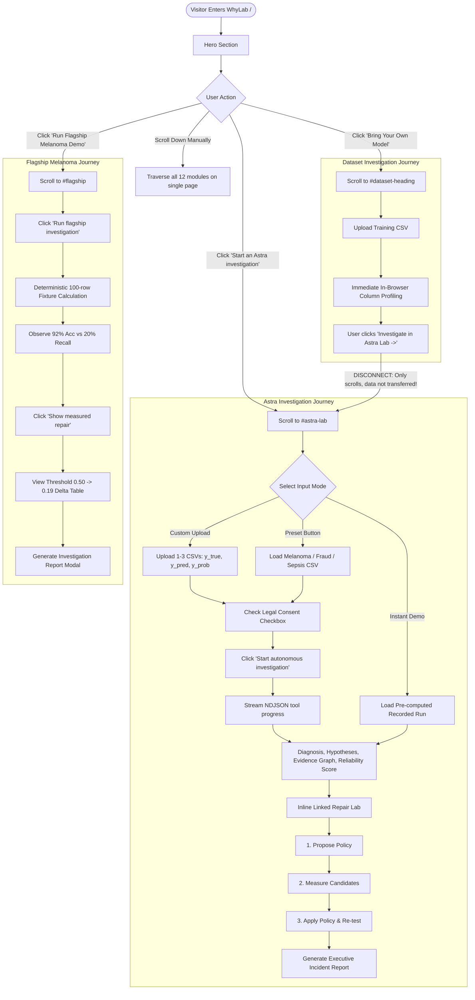
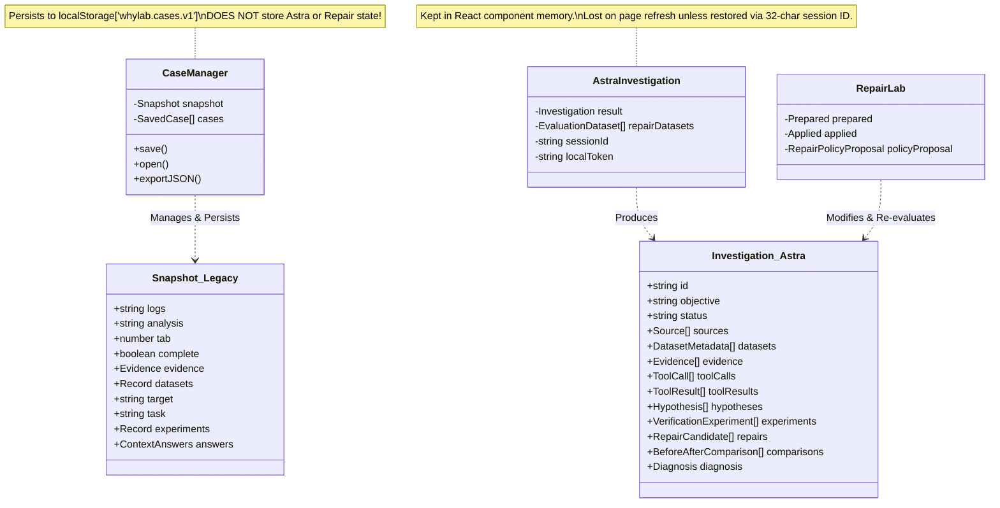
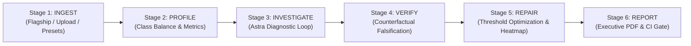

# WHYLAB — FRONTEND WORKFLOW AND NAVIGATION AUDIT

**Author:** Senior Frontend Architect & ML Systems UX Engineer  
**Repository:** [WhyLab-GPT-Astra](file:///c:/Users/varun/OneDrive/Desktop/whylab)  
**Date:** September 24, 2026  
**Audit Target:** Architecture, Navigation, State Persistence, and Strategy Alignment  
**Project Context:** OpenAI GPT-6 Astra Challenge / Product Hunt Launch  

---

## Executive Summary

WhyLab contains an **extremely capable, mathematically sound, and feature-complete backend and diagnostic tool engine** (statistical metrics, counterfactual falsification, leakage scanners, threshold sweeps, cost matrices, DAG evidence graphs, and executive incident reports).

However, the frontend currently suffers from a **fundamental architectural bifurcation**:
1. **The Heuristic Dashboard (Architecture A):** An older client-side log parser and dataset profiler (`CaseManager`, `InvestigationLab` workspace, `EvidenceImport`, `DatasetLab`, `DiagnosisPanel`, `InteractiveLesson`, `ExperimentWorkflow`, `ExplanationAssistant`), centered around `Snapshot` in [cases.ts](file:///c:/Users/varun/OneDrive/Desktop/whylab/app/lib/cases.ts) and saved in `localStorage['whylab.cases.v1']`.
2. **The Astra-Native Investigation Engine (Architecture B):** Built to fulfill the GPT-6 Astra Challenge strategy (`FlagshipMelanoma`, `CaseStudies`, `AstraInvestigation`, `RepairLab`, `EvidenceGraph`, `ReliabilityProfile`, `ChallengeReview`, `IncidentReportExport`, `InvestigationReportModal`), centered around the formal typed schema `Investigation` in [types.ts](file:///c:/Users/varun/OneDrive/Desktop/whylab/app/lib/investigation/types.ts).

Because both systems are currently stacked together on **one single vertical scrolling page** ([app/page.tsx](file:///c:/Users/varun/OneDrive/Desktop/whylab/app/page.tsx)), a first-time visitor encounters overlapping section numbering, duplicate modules (two Repair Labs, two lesson tools, three reporting mechanisms), disconnected file upload dropzones, and anchor links that scroll the page without transferring dataset state.

This audit provides a precise, evidence-based roadmap to consolidate the frontend into a single, cohesive, beginner-friendly pipeline:  
**`Observe → Ingest & Profile → Autonomous Diagnosis → Falsification & Verification → Repair Lab → Executive Incident Report`** without rewriting backend logic or breaking existing automated CDP test contracts.

---

## A. Existing Route and Component Map

### 1. Route Map
WhyLab uses Next.js App Router (version 16.3.5 with React 19.2.8). The entire application is mounted on a **single public web route**:

| HTTP Route | Handler File | Purpose |
| :--- | :--- | :--- |
| **`/`** | [app/page.tsx](file:///c:/Users/varun/OneDrive/Desktop/whylab/app/page.tsx) | Root and only user-facing page. Renders `<CaseManager><InvestigationLab /></CaseManager>`. |
| **`/api/investigate`** | [app/api/investigate/route.ts](file:///c:/Users/varun/OneDrive/Desktop/whylab/app/api/investigate/route.ts) | Serverless route handler. Streams NDJSON events (`progress`, `tool_call`, `result`) from Astra investigator. |
| **`/api/repair`** | [app/api/repair/route.ts](file:///c:/Users/varun/OneDrive/Desktop/whylab/app/api/repair/route.ts) | Translates natural language objectives into numeric cost policies and trade-off highlights. |
| **`/api/explain`** | [app/api/explain/route.ts](file:///c:/Users/varun/OneDrive/Desktop/whylab/app/api/explain/route.ts) | Generates rule-based or OpenAI-powered explanations for heuristic hypotheses. |
| **`/api/investigation-sessions/[id]`** | [app/api/investigation-sessions/[id]/route.ts](file:///c:/Users/varun/OneDrive/Desktop/whylab/app/api/investigation-sessions/%5Bid%5D/route.ts) | Restores completed Astra investigation JSON snapshots by 32-character session ID (24-hour retention). |
| **`/api/health`** | `app/api/health/route.ts` | Health check probe. |
| **`/api/vision`** | `app/api/vision/route.ts` | Vision diagnostics endpoint. |

---

### 2. Component Hierarchy and Rendering Tree

```
app/layout.tsx (RootLayout: Geist fonts, openGraph/twitter metadata)
└── app/page.tsx (Home)
    └── CaseManager (app/components/case-manager.tsx)
        ├── <details> "01 / Investigation library" (localStorage save, JSON import/export)
        └── InvestigationLab (app/components/investigation-lab.tsx)
            ├── <header className="topbar"> (Logo, anchor navigation links, "+ New investigation")
            ├── <section className="hero"> (Eyebrow, title, tension card, distinction banner, CTAs, orbit graphic)
            ├── <ol className="workbench-flow"> (Static 4-step diagram: Observe, Investigate, Test, Repair)
            │
            │   ─── SECTION A: ASTRA-NATIVE SHOWCASE & EXPERIMENTS ───
            ├── FlagshipMelanoma (app/components/flagship-melanoma.tsx) [#flagship]
            │   ├── FlagshipChart (SVG Precision-Recall & Cost curves)
            │   ├── Stage 01: Observe failure signal (accuracy vs recall)
            │   ├── Stage 02: Competing hypotheses
            │   ├── Stage 03: Falsification test (balanced counterfactual)
            │   ├── Stage 04: Repair policy drawer (threshold sweep, before/after table)
            │   │   ├── ConfusionMatrixHeatmap (app/components/confusion-matrix-heatmap.tsx)
            │   │   ├── EvidenceGraph (app/components/evidence-graph.tsx)
            │   │   ├── ClassroomLesson (app/components/classroom-lesson.tsx)
            │   │   ├── ReliabilityProfile (app/components/reliability-profile.tsx)
            │   │   ├── ChallengeReview (app/components/challenge-review.tsx)
            │   │   └── IncidentReportExport (app/components/incident-report-export.tsx)
            │   └── InvestigationReportModal (app/components/investigation-report-modal.tsx)
            │
            ├── CaseStudies (app/components/case-studies.tsx) [#case-studies]
            │   ├── Scenario selector (Calibration drift & Site shift)
            │   └── Mounts: EvidenceGraph, ReliabilityProfile, IncidentReportExport, ReportModal
            │
            ├── AstraInvestigation (app/components/astra-investigation.tsx) [#astra-lab]
            │   ├── Recorded Demo Callout ("View recorded investigation" button)
            │   ├── Multi-CSV input & paste textarea (y_true, y_pred, y_probability)
            │   ├── Training log input & diagnostic preview
            │   ├── Presets (Melanoma, Fraud, Sepsis, Synthetic)
            │   ├── Config controls (Objective, paradox gap, specialist selector, steering)
            │   ├── Shared deployment token & consent disclosure
            │   ├── Live streaming activity feed & progress events
            │   ├── Results synthesis (Primary diagnosis, hypotheses, evidence badges)
            │   ├── Mounted submodules: EvidenceGraph, ClassroomLesson, ReliabilityProfile,
            │   │   ChallengeReview, IncidentReportExport, InvestigationReportModal
            │   └── Linked RepairLab (app/components/repair-lab.tsx) [rendered inline when datasets bound]
            │
            ├── Standalone RepairLab (app/components/repair-lab.tsx) [#repair-lab]
            │   ├── Evaluation CSV paste & example loader
            │   ├── Repair objective & 4-cell cost matrix (FN, FP, Target, Baseline)
            │   ├── 3-step action buttons: Translate Objective, Measure Local, Ask Astra
            │   ├── Climax Delta Card (FN reduction, recall recovery, FP trade-off, cost ceiling)
            │   ├── ConfusionMatrixHeatmap
            │   ├── Applied policy re-test banner
            │   └── Mounted submodules: EvidenceGraph, ReliabilityProfile, ChallengeReview, IncidentReportExport
            │
            │   ─── SECTION B: HEURISTIC WORKSPACE & DATASET PROFILER ───
            ├── <section id="workspace"> "02 / Investigation workspace"
            │   ├── Tabs: Upload (dropzone), Paste logs, Try an example
            │   ├── Analysis type dropdown
            │   ├── Button: "Investigate failure" (runs local worker via ingestion-client.ts)
            │   ├── Illustrative ResNet-18 Case File 001 card
            │   └── Local Results (EvidenceSummary, rank-ordered heuristic hypothesis accordions)
            │
            ├── EvidenceImport (app/components/evidence-import.tsx) "04 / Extended evidence import"
            │   ├── Multi-file selector (up to 5 files, CSV/LOG/JSON)
            │   └── Column-header mapping dropdowns (metricColumns)
            │
            ├── DatasetLab (app/components/dataset-lab.tsx) "03 / Dataset investigation" [#dataset-heading]
            │   ├── Presets bar (Multi-split experiments)
            │   ├── 3 Upload Cards: Training, Validation, Production CSVs (up to 500k rows)
            │   ├── BYOM Bridge Buttons: "Investigate in Astra Lab →", "Optimize in Repair Lab →"
            │   ├── Column Profiling Table (Inferred types, missingness, numeric ranges, class meters)
            │   ├── Distribution drift comparison cards (compareDatasets)
            │   └── DiagnosisPanel (app/components/diagnosis-panel.tsx) "05 / Combined diagnosis"
            │       ├── Context answer selects (sameRun, comparable, available)
            │       └── Diagnosis accordions:
            │           ├── ExplanationAssistant (app/components/explanation-assistant.tsx) "08"
            │           ├── ExperimentWorkflow (app/components/experiment-workflow.tsx) "07"
            │           └── InteractiveLesson (app/components/interactive-lesson.tsx) "06"
            │
            │   ─── SECTION C: SPECIALIST DOMAIN & FOOTER ───
            ├── VisionLab (app/components/vision-lab.tsx) [#vision-lab]
            │   ├── Image classifier prediction ingestion
            │   ├── Duplicate & near-duplicate leakage scanner
            │   ├── Slice performance evaluator
            │   ├── Concept falsification engine
            │   └── Decision basis audit export
            │
            ├── <section className="learning"> ("What you’ll learn": 3 static educational cards)
            ├── <footer> (Brand wordmark, metadata)
            ├── SubmissionReadinessModal (app/components/submission-readiness-modal.tsx)
            └── DemoTour (app/components/demo-tour.tsx)
```

---

## B. Current User Journey



### Detailed Trace of Key Journey Milestones:
1. **What the user sees first:**
   - A collapsed accordion `01 / Investigation library` at the absolute top of the page.
   - Sticky topbar containing the wordmark, 7 navigation links, and a `+ New investigation` button.
   - A large Hero section with the tension card: *YOUR MODEL SAYS: 94.2% ACCURACY* vs *WHYLAB SAYS: HIGH-RISK FAILURE DETECTED (Malignant recall: 22.4%)*, followed by the Local vs. Astra distinction banner.
2. **How they start a new investigation:**
   - If they click `+ New investigation` in the topbar, it calls `reset()`, incrementing `astraKey` (re-mounting and wiping Astra/Flagship state), calling `newCase()` in `CaseManager`, invalidating log parses, and scrolling to the top.
   - Or they click the Hero CTA buttons to jump directly into Flagship (`#flagship`), Astra (`#astra-lab`), or BYOM (`#dataset-heading`).
3. **How an investigation is created and identified:**
   - In Astra: Created on the server during `/api/investigate`. A 32-character hexadecimal `sessionId` is returned (e.g. `a1b2c3d4...`) valid for 24-hour restore.
   - In Flagship: Hardcoded ID `WH-1042-MELANOMA`.
   - In CaseManager: Random UUID `crypto.randomUUID()`, named `"Untitled investigation"`.
4. **Where dataset upload happens:**
   - Occurs in **four disconnected places**:
     1. Astra Investigation (`#astra-lab`): Multi-CSV file picker for evaluation CSVs (`y_true, y_pred, y_probability`).
     2. Dataset Lab (`#dataset-heading`): Three upload dropzones for Training, Validation, and Production CSVs.
     3. Investigation Workspace (`#workspace`): Drag-and-drop zone for logs, TXT, JSON, or CSV.
     4. Extended Evidence Import: Multi-file picker with column mapping.
5. **Where dataset configuration happens:**
   - Astra: Positive/Negative class labels, Objective string, paradox gap ceiling, specialist persona selector.
   - Dataset Lab: Task type (`classification` vs `regression`), Target column select.
   - Repair Lab: Error cost matrix (False Negative cost, False Positive cost, Acceptance ceiling, Baseline threshold).
6. **What happens immediately after uploading a dataset:**
   - In Dataset Lab: Immediate client-side parse, column typing, missingness calculation, and distribution drift comparison.
   - In Astra: Files are read into memory and filenames listed; no analysis runs until the user checks consent and clicks "Start autonomous investigation".
7. **How the user reaches each investigation module:**
   - Currently by **continuous downward page scrolling** or clicking topbar anchor links (`#workspace`, `#flagship`, `#astra-lab`, `#repair-lab`, `#vision-lab`).
8. **How the user returns to a previous stage:**
   - Purely by scrolling back up. There is no breadcrumb, progress stepper, or state-aware back button.
9. **How the application preserves investigation data:**
   - CaseManager saves to `localStorage['whylab.cases.v1']`, but **only saves Architecture A data** (logs, profiler datasets, manual verification attempts).
   - Astra investigation results, Repair Lab sweeps, and Flagship runs are **not saved in CaseManager**. If the page is reloaded, Astra results vanish unless restored by typing the 32-character session ID into a text input.
10. **How the user starts an Astra investigation:**
    - Scrolls to `#astra-lab`, selects a preset or uploads CSVs, checks the consent box, and clicks "Start autonomous investigation" (or clicks "View recorded investigation" for the instant demo).
11. **How the diagnosis reaches verification and repair:**
    - In Astra: Streaming tool calls autonomously verify hypotheses via counterfactual tests; upon completion, a linked `<RepairLab />` is automatically mounted at the bottom of Astra's output.
    - In Flagship: Clicking "Show measured repair" opens an inline repair drawer.
    - In Workspace (Architecture A): Clicking a hypothesis opens an `<ExperimentWorkflow />` asking the user to manually type in hypothetical baseline and after numbers from an external run.
12. **How the user reaches the final report:**
    - In Flagship and Astra: By clicking the prominent "Generate Investigation Report" button (which opens the printable executive modal), or downloading the technical incident report from the mounted `IncidentReportExport` panel.

---

## C. Actual Implementation Status of Each Module

| Module Name | File Path(s) | Strategy Doc Stage | Implementation Status | Technical Reality & Evidence |
| :--- | :--- | :--- | :--- | :--- |
| **Ingestion & Data Profiler** | [dataset-lab.tsx](file:///c:/Users/varun/OneDrive/Desktop/whylab/app/components/dataset-lab.tsx), [evaluation-ingestion.ts](file:///c:/Users/varun/OneDrive/Desktop/whylab/app/lib/investigation/evaluation-ingestion.ts) | Stage 1 (Ingestion) | **Fully Implemented** | Robust in-browser CSV parsing up to 500k rows (sampled to 25k for interactive reactivity), KS drift tests, class prevalence, and schema verification. |
| **Astra Autonomous Investigator** | [astra-investigation.tsx](file:///c:/Users/varun/OneDrive/Desktop/whylab/app/components/astra-investigation.tsx), [investigator.ts](file:///c:/Users/varun/OneDrive/Desktop/whylab/app/lib/investigation/investigator.ts) | Stage 2 & 3 (Evidence & Hypotheses) | **Fully Implemented** | Genuine multi-turn autonomous tool loop via `/api/investigate`. Calls diagnostic tools, ranks hypotheses with structured confidence, and supports instant recorded replay. |
| **Flagship Melanoma Demo** | [flagship-melanoma.tsx](file:///c:/Users/varun/OneDrive/Desktop/whylab/app/components/flagship-melanoma.tsx), [flagship-chart.tsx](file:///c:/Users/varun/OneDrive/Desktop/whylab/app/components/flagship-chart.tsx) | Strategy §14 (Flagship Demo) | **Fully Implemented** | Deterministic 1-click execution demonstrating 92.0% accuracy vs 20.0% minority recall. Interactive PR-curve SVG with cost overlays. |
| **Evidence Graph (DAG)** | [evidence-graph.tsx](file:///c:/Users/varun/OneDrive/Desktop/whylab/app/components/evidence-graph.tsx), [evidence-graph.ts](file:///c:/Users/varun/OneDrive/Desktop/whylab/app/lib/investigation/evidence-graph.ts) | Strategy §5 (Evidence Graph) | **Fully Implemented** | Interactive node-edge visualization tracing observations → hypotheses → experiments → results → repairs. Search, node filtering, and inspector drawer. |
| **Falsification & Verification** | [counterfactual.ts](file:///c:/Users/varun/OneDrive/Desktop/whylab/app/lib/investigation/counterfactual.ts), [diagnostic-falsification.ts](file:///c:/Users/varun/OneDrive/Desktop/whylab/app/lib/investigation/diagnostic-falsification.ts) | Stage 4 (Verification) | **Fully Implemented** | Deterministic tests that attempt to disprove hypotheses (e.g. balanced accuracy recalculation, stratified evaluation, leakage scan). |
| **Repair Lab** | [repair-lab.tsx](file:///c:/Users/varun/OneDrive/Desktop/whylab/app/components/repair-lab.tsx), [repair-lab.ts](file:///c:/Users/varun/OneDrive/Desktop/whylab/app/lib/investigation/repair-lab.ts) | Stage 5 (Repair) | **Fully Implemented** | 101-point threshold sweep, cost-matrix optimization, AI policy translation, before/after impact grid, and confusion matrix heatmap. |
| **Re-evaluation & Comparison** | [linked-repair.ts](file:///c:/Users/varun/OneDrive/Desktop/whylab/app/lib/investigation/linked-repair.ts), [repair-reevaluation.ts](file:///c:/Users/varun/OneDrive/Desktop/whylab/app/lib/investigation/repair-reevaluation.ts) | Stage 6 (Re-evaluation) | **Fully Implemented** | Rigorous verification requiring the repaired operating point to meet the declared acceptance ceiling on unchanged rows. |
| **Investigation Report Modal** | [investigation-report-modal.tsx](file:///c:/Users/varun/OneDrive/Desktop/whylab/app/components/investigation-report-modal.tsx) | Strategy §13 (Incident Report) | **Fully Implemented** | Screenshot-friendly executive modal with `@media print` clean PDF rendering, copy markdown, symptom cards, and before/after repair deltas. |
| **Incident Report Export** | [incident-report-export.tsx](file:///c:/Users/varun/OneDrive/Desktop/whylab/app/components/incident-report-export.tsx), [incident-report.ts](file:///c:/Users/varun/OneDrive/Desktop/whylab/app/lib/investigation/incident-report.ts) | Strategy §13 (Engineering Artifact) | **Fully Implemented** | Real engineering artifacts: JSON download, Markdown export, 1-click GitHub Issue generator, CI gate JSON (`whylab-ci-gate.json`), and GitHub Actions workflow YAML. |
| **Adversarial Review (Challenge WhyLab)** | [challenge-review.tsx](file:///c:/Users/varun/OneDrive/Desktop/whylab/app/components/challenge-review.tsx), [challenge-review.ts](file:///c:/Users/varun/OneDrive/Desktop/whylab/app/lib/investigation/challenge-review.ts) | Strategy §10 (Adversarial Review) | **Fully Implemented** | Second-pass review evaluating alternative causes (class imbalance, covariate shift, leakage), with confidence shifts and adversarial diagnostics. |
| **Reliability Profile (Score)** | [reliability-profile.tsx](file:///c:/Users/varun/OneDrive/Desktop/whylab/app/components/reliability-profile.tsx), [reliability-profile.ts](file:///c:/Users/varun/OneDrive/Desktop/whylab/app/lib/investigation/reliability-profile.ts) | Strategy §12 (Reliability Score) | **Fully Implemented** | Composite 0–100 index across 6 dimensions with documented weights and before-vs-after repair transition (e.g. 38 -> 81). |
| **Investigation Library (CaseManager)** | [case-manager.tsx](file:///c:/Users/varun/OneDrive/Desktop/whylab/app/components/case-manager.tsx), [cases.ts](file:///c:/Users/varun/OneDrive/Desktop/whylab/app/lib/cases.ts) | Persistence | **Partially Implemented (Bifurcated)** | Works for old heuristic snapshots; does not save or restore Astra investigations or Repair Lab results. |
| **Extended Evidence Import** | [evidence-import.tsx](file:///c:/Users/varun/OneDrive/Desktop/whylab/app/components/evidence-import.tsx) | Extended Evidence | **Partially Implemented (Bifurcated)** | Multi-file import and column mapping work, but output binds to old `Evidence` model, not the Astra `Investigation` engine. |
| **Combined Diagnosis** | [diagnosis-panel.tsx](file:///c:/Users/varun/OneDrive/Desktop/whylab/app/components/diagnosis-panel.tsx) | Diagnosis | **Partially Implemented (Bifurcated)** | Rule-based heuristic diagnosis combining logs and datasets. Superseded by Astra's structured diagnosis. |
| **Classroom Worksheet** | [classroom-lesson.tsx](file:///c:/Users/varun/OneDrive/Desktop/whylab/app/components/classroom-lesson.tsx) | Education | **Fully Implemented** | Interactive calculation worksheet with hints, answer validation, and JSON download. |
| **Interactive Lesson (Heuristic)** | [interactive-lesson.tsx](file:///c:/Users/varun/OneDrive/Desktop/whylab/app/components/interactive-lesson.tsx) | Education | **Fully Implemented (Legacy)** | Interactive simulation chart and quiz for heuristic findings. |
| **Explanation Assistant** | [explanation-assistant.tsx](file:///c:/Users/varun/OneDrive/Desktop/whylab/app/components/explanation-assistant.tsx) | Explanation | **Fully Implemented (Legacy)** | Calls `/api/explain` with excerpt payload. Has its own separate token input unlinked from shared state. |
| **Vision Lab** | [vision-lab.tsx](file:///c:/Users/varun/OneDrive/Desktop/whylab/app/components/vision-lab.tsx), [duplicate-scanner.ts](file:///c:/Users/varun/OneDrive/Desktop/whylab/app/lib/vision/duplicate-scanner.ts) | Specialist Domain | **Fully Implemented** | Full-fledged vision failure investigator (duplicate leakage, slices, concept falsification, decision audit). |

---

## D. Current Investigation State Architecture



### Detailed State Inventory and Survival Matrix:

| State Variable | Held In | Where It Lives | Survives Navigation? | Survives Page Refresh? | Survives Case Switch? |
| :--- | :--- | :--- | :--- | :--- | :--- |
| **Investigation ID** (CaseManager) | `active` | React state in `CaseManager` | Yes | Only if user clicked "Save case" | Overwritten |
| **Investigation ID** (Astra) | `result.id`, `sessionId` | React state in `AstraInvestigation` | Yes (while unmounted) | **NO** (lost; requires manual 32-char ID restore) | **NO** (reset by `+ New investigation`) |
| **Uploaded Dataset** (Profiler) | `datasets` | React state in `CaseManager` | Yes | Only if saved in CaseManager | Reset |
| **Uploaded Dataset** (Astra) | `files`, `csv` | React state in `AstraInvestigation` | Yes | Only if `saveDraft` checked (`whylab-astra-draft-v1`) | Reset |
| **Dataset Configuration** | `target`, `task` | React state in `CaseManager` | Yes | Only if saved in CaseManager | Reset |
| **Astra Configuration** | `positive`, `negative`, `objective`, `gap` | React state in `AstraInvestigation` | Yes | Yes (if `saveDraft` active) | Reset |
| **Astra Investigation Status** | `events`, `busy` | React state in `AstraInvestigation` | Yes | **NO** | Reset |
| **Hypotheses** (Astra) | `result.hypotheses` | React state in `AstraInvestigation` | Yes | **NO** | Reset |
| **Verification Results** | `result.experiments` | React state in `AstraInvestigation` | Yes | **NO** | Reset |
| **Repair Candidates & Delta** | `prepared`, `applied` | React state in `RepairLab` | Yes | **NO** | Reset |
| **Report Data** | Dynamic props | Generated on modal open | Yes | **NO** | Reset |
| **Shared Deployment Token** | `deploymentToken` | React state in `InvestigationLab` | Yes | **NO** (memory only) | Preserved |

---

## E. Specific UX and Navigation Problems

### 1. The "Two Distinct Platforms" Confusion
A first-time user does not realize that the upper half of the page (`FlagshipMelanoma`, `AstraInvestigation`, `RepairLab`) is a completely separate application from the lower half (`Investigation workspace`, `Dataset investigation`, `Extended evidence import`, `Combined diagnosis`). Uploading a dataset in `DatasetLab` does not populate Astra or Repair Lab.

### 2. Disconnected Bridge Buttons
In [dataset-lab.tsx](file:///c:/Users/varun/OneDrive/Desktop/whylab/app/components/dataset-lab.tsx#L253-L267), when a user uploads a dataset and sees the prompt:
- `🔬 Investigate in Astra Lab →`
- `⚙️ Optimize in Repair Lab →`  
Clicking these buttons **merely scrolls the browser window** to `#astra-lab` or `#repair-lab`. The uploaded CSV is **not transferred** into Astra's input or Repair Lab's textarea. The user arrives at an empty form and must upload their file a second time!

### 3. Duplicate Modules Cluttering the Screen
- **Two Repair Labs:** A standalone `<RepairLab />` is permanently mounted at `#repair-lab`, and a second `<RepairLab />` is dynamically mounted inside `<AstraInvestigation />` when a run completes.
- **Two Lesson Modules:** `<ClassroomLesson />` (tied to formal Astra measurements) and `<InteractiveLesson />` (tied to legacy heuristic findings).
- **Three Report Generators:** `<InvestigationReportModal />` (executive card), `<IncidentReportExport />` (CI/GitHub/YAML exporter), and `caseMarkdown` in `CaseManager`.

### 4. Jarring Section Numbering
While section numbers inside the legacy workspace were renumbered `01` to `08`, the main flagship modules (`FlagshipMelanoma`, `AstraInvestigation`, `RepairLab`) have **no section numbers**. A visitor scrolling down sees:
- `01 / Investigation library` (at top)
- [Flagship - no number]
- [Astra - no number]
- [Repair Lab - no number]
- `02 / Investigation workspace`
- `04 / Extended evidence import` (rendered *above* 03!)
- `03 / Dataset investigation` (rendered *below* 04!)
- `05 / Combined diagnosis`

### 5. Fragile State and Accidental Data Loss
Clicking `+ New investigation` in the top header executes `reset()`, which increments `astraKey` and wipes the active Astra investigation, the Repair Lab sweep, and all Flagship results without confirmation.

### 6. Wall-of-Text Fatigue and Cognitive Overload
Because all 12 modules render on one page, the DOM contains over 25,000 words of text, multiple duplicate charts, and hundreds of interactive inputs, causing scroll fatigue before the user even reaches the Repair Lab climax.

---

## F. Recommended Module Arrangement

We recommend organizing WhyLab into a **single, unified, stage-gated investigation workflow** using the existing components without introducing heavy routing frameworks or breaking changes:



### Proposed Unified Pipeline:

1. **Top Navigation & State Bar:**
   - Active Investigation Badge: Displays current case ID (e.g. `WH-1042-MELANOMA` or custom dataset name).
   - Global Pipeline Stepper (clickable breadcrumb):  
     `01 Ingest` → `02 Profile` → `03 Investigate` → `04 Verify` → `05 Repair` → `06 Report`
   - Actions: `Governance Gate`, `Shared Token Indicator`, `+ New Investigation`.

2. **Stage 1: Ingest & Evidence Collection (`#ingest`)**
   - **Lead with Clarity:** Three prominent cards:
     - **Option A (Flagship 1-Click):** "Melanoma Accuracy Paradox (Synthetic)" → 1 click to load and run.
     - **Option B (Bring Your Own Model):** Evaluation CSV upload (`y_true, y_pred, y_probability`).
     - **Option C (Multi-Split Dataset / Presets):** Quick-load ICU Sepsis, Stroke, or Fraud presets.
   - **Unified Data Ingestion:** Uploading a CSV here **automatically feeds** both DatasetLab (profiler) and Astra/RepairLab.

3. **Stage 2: Dataset Profile & Failure Observation (`#profile`)**
   - Embeds [dataset-lab.tsx](file:///c:/Users/varun/OneDrive/Desktop/whylab/app/components/dataset-lab.tsx).
   - Shows the immediate failure paradox: 94.2% Validation Accuracy vs 22.4% Minority Recall.
   - Displays inferred column types, class imbalance meters, and distribution comparisons.
   - Clear CTA button: **`Continue to Autonomous Investigation →`** (smoothly transitions to Stage 3 with data pre-bound).

4. **Stage 3: Autonomous Investigation & Evidence Graph (`#investigate`)**
   - Embeds [astra-investigation.tsx](file:///c:/Users/varun/OneDrive/Desktop/whylab/app/components/astra-investigation.tsx).
   - Autonomous tool calling stream (or instant pre-computed replay).
   - Renders the primary diagnosis, confidence scores, and [evidence-graph.tsx](file:///c:/Users/varun/OneDrive/Desktop/whylab/app/components/evidence-graph.tsx).
   - Evaluates alternative failure causes via [challenge-review.tsx](file:///c:/Users/varun/OneDrive/Desktop/whylab/app/components/challenge-review.tsx).

5. **Stage 4: Falsification & Scientific Verification (`#verify`)**
   - Surfaces the counterfactual experiment results ([counterfactual.ts](file:///c:/Users/varun/OneDrive/Desktop/whylab/app/lib/investigation/counterfactual.ts)).
   - Clearly proves whether the primary hypothesis (e.g. class imbalance + threshold misalignment) is supported or rejected.
   - Displays the 6-dimension [reliability-profile.tsx](file:///c:/Users/varun/OneDrive/Desktop/whylab/app/components/reliability-profile.tsx) baseline score (e.g. `38 / 100 HIGH RISK`).

6. **Stage 5: Repair Lab & Re-evaluation Climax (`#repair`)**
   - **Single Unified Repair Lab:** Consolidate into the existing [repair-lab.tsx](file:///c:/Users/varun/OneDrive/Desktop/whylab/app/components/repair-lab.tsx).
   - User states domain costs (e.g. Missing a cancer case is 50× more expensive).
   - 101-threshold sweep identifies optimal boundary (e.g. `0.50 → 0.19`).
   - Climax impact card: 0 missed cancers (-100%), +80 pp recall, -95% total cost.
   - Live [confusion-matrix-heatmap.tsx](file:///c:/Users/varun/OneDrive/Desktop/whylab/app/components/confusion-matrix-heatmap.tsx) before/after view.
   - Reliability score transition: `38 → 81 LOW RISK`.

7. **Stage 6: Executive Incident Report & Production Gate (`#report`)**
   - 1-Click "View Executive Incident Report" (opens [investigation-report-modal.tsx](file:///c:/Users/varun/OneDrive/Desktop/whylab/app/components/investigation-report-modal.tsx) for print-to-PDF).
   - Technical artifacts panel ([incident-report-export.tsx](file:///c:/Users/varun/OneDrive/Desktop/whylab/app/components/incident-report-export.tsx)):
     - Download JSON incident snapshot
     - Copy / Open pre-filled GitHub Issue
     - Download `whylab-ci-gate.json` and `.github/workflows/whylab-gate.yml`
     - Download Prometheus alerting rules

8. **Secondary / Specialist Tabs (Drawer or Sub-views):**
   - **Vision Lab:** Accessible via topbar tab `#vision-lab` for specialized computer vision failure auditing.
   - **Educational Classroom:** Accessible via collapsible drawer for academic grading / worksheets.
   - **Case Studies:** Quick-load selector inside Stage 1.

---

## G. Files That Need Modification

| File Path | Component / Layer | Nature of Required Modification |
| :--- | :--- | :--- |
| [app/components/investigation-lab.tsx](file:///c:/Users/varun/OneDrive/Desktop/whylab/app/components/investigation-lab.tsx) | App Shell / Workbench Layout | Reorder vertical layout into the 6-stage logical flow. Connect the top `workbench-flow` into an active, clickable stage stepper. Remove duplicate standalone Repair Lab mount so only linked Repair Lab is presented. |
| [app/components/dataset-lab.tsx](file:///c:/Users/varun/OneDrive/Desktop/whylab/app/components/dataset-lab.tsx) | Dataset Profiler | Update the BYOM bridge buttons so clicking "Investigate in Astra Lab" passes the uploaded dataset text directly into shared investigation state instead of merely anchor-scrolling. |
| [app/components/astra-investigation.tsx](file:///c:/Users/varun/OneDrive/Desktop/whylab/app/components/astra-investigation.tsx) | Astra Investigator | Accept an incoming dataset prop from shared state so uploaded datasets populate automatically. Ensure stage transition smoothly opens linked Repair Lab upon completion. |
| [app/components/explanation-assistant.tsx](file:///c:/Users/varun/OneDrive/Desktop/whylab/app/components/explanation-assistant.tsx) | Explanation Submodule | Bind its token input to the shared deployment token (`sharedToken`) to eliminate the duplicate access token field. |
| [app/components/case-manager.tsx](file:///c:/Users/varun/OneDrive/Desktop/whylab/app/components/case-manager.tsx) | Persistence / Library | Allow CaseManager to optionally store and restore Astra `Investigation` objects alongside legacy snapshots, or collapse it into a clean "Saved Cases" drawer. |
| [app/globals.css](file:///c:/Users/varun/OneDrive/Desktop/whylab/app/globals.css) | Styling & Tokens | Minor styling adjustments for the unified stage stepper, active stage transitions, and bridge action cards. |

---

## H. Files That Must Remain Unchanged

The following files contain core mathematical logic, statistical tests, API streaming contracts, or automated test hooks and **MUST NOT be modified**:

1. **Deterministic Investigation & Math Logic:**
   - [app/lib/investigation/classification-metrics.ts](file:///c:/Users/varun/OneDrive/Desktop/whylab/app/lib/investigation/classification-metrics.ts) (Exact classification math, PR-AUC, confusion matrices)
   - [app/lib/investigation/counterfactual.ts](file:///c:/Users/varun/OneDrive/Desktop/whylab/app/lib/investigation/counterfactual.ts) (Balanced accuracy & stratified falsification)
   - [app/lib/investigation/repair-lab.ts](file:///c:/Users/varun/OneDrive/Desktop/whylab/app/lib/investigation/repair-lab.ts) (101-threshold sweep, cost calculations, candidate selection)
   - [app/lib/investigation/linked-repair.ts](file:///c:/Users/varun/OneDrive/Desktop/whylab/app/lib/investigation/linked-repair.ts) (Evaluation dataset binding and re-test comparison)
   - [app/lib/investigation/reliability-profile.ts](file:///c:/Users/varun/OneDrive/Desktop/whylab/app/lib/investigation/reliability-profile.ts) (Composite 0-100 scoring formulas)
   - [app/lib/investigation/challenge-review.ts](file:///c:/Users/varun/OneDrive/Desktop/whylab/app/lib/investigation/challenge-review.ts) (Adversarial diagnostic rules)
   - [app/lib/investigation/flagship-melanoma.ts](file:///c:/Users/varun/OneDrive/Desktop/whylab/app/lib/investigation/flagship-melanoma.ts) (Flagship deterministic benchmark)

2. **Schema & Contract Definitions:**
   - [app/lib/investigation/schema.ts](file:///c:/Users/varun/OneDrive/Desktop/whylab/app/lib/investigation/schema.ts)
   - [app/lib/investigation/types.ts](file:///c:/Users/varun/OneDrive/Desktop/whylab/app/lib/investigation/types.ts)
   - [app/lib/investigation/primitives.ts](file:///c:/Users/varun/OneDrive/Desktop/whylab/app/lib/investigation/primitives.ts)
   - [app/lib/investigation/tool-contracts.ts](file:///c:/Users/varun/OneDrive/Desktop/whylab/app/lib/investigation/tool-contracts.ts)

3. **Backend Route Handlers & Server Services:**
   - [app/api/investigate/route.ts](file:///c:/Users/varun/OneDrive/Desktop/whylab/app/api/investigate/route.ts)
   - [app/api/repair/route.ts](file:///c:/Users/varun/OneDrive/Desktop/whylab/app/api/repair/route.ts)
   - [app/api/investigation-sessions/[id]/route.ts](file:///c:/Users/varun/OneDrive/Desktop/whylab/app/api/investigation-sessions/%5Bid%5D/route.ts)
   - [app/lib/server/openai-investigator.ts](file:///c:/Users/varun/OneDrive/Desktop/whylab/app/lib/server/openai-investigator.ts)
   - [app/lib/server/openai-repair.ts](file:///c:/Users/varun/OneDrive/Desktop/whylab/app/lib/server/openai-repair.ts)
   - [app/lib/server/access-control.ts](file:///c:/Users/varun/OneDrive/Desktop/whylab/app/lib/server/access-control.ts)
   - [app/lib/server/shared-quota.ts](file:///c:/Users/varun/OneDrive/Desktop/whylab/app/lib/server/shared-quota.ts)

4. **Specialist Domain Modules:**
   - Entire [app/lib/vision/](file:///c:/Users/varun/OneDrive/Desktop/whylab/app/lib/vision) directory and [vision-lab.tsx](file:///c:/Users/varun/OneDrive/Desktop/whylab/app/components/vision-lab.tsx).

---

## I. Potential Regression Risks and Protection Measures

| Risk Factor | Root Cause | Impact | Protection / Mitigation Strategy |
| :--- | :--- | :--- | :--- |
| **Breaking CDP Browser Test Suite** | [scripts/browser-check.mjs](file:///c:/Users/varun/OneDrive/Desktop/whylab/scripts/browser-check.mjs) searches for strict CSS selectors, element classes, and button labels (e.g. `.skip-link`, `.astra-consent input`, `button('2. Measure local candidates')`, `button('Apply recommended policy')`, `#repair-lab textarea`, `.flagship-results`). | `npm run test:browser` fails immediately. | **Preserve all existing IDs, class names, test attributes, and exact button text** in the markup. Do not rename `#linked-repair-lab`, `#repair-lab`, `#flagship`, or `.astra-lab`. |
| **Loss of In-Memory Astra Run** | Unmounting components during stage tab switches in React will destroy their internal state (`result`, `events`, `prepared`, `applied`). | User runs Astra, clicks to see profile, and loses their investigation results. | **Do not unmount components conditionally**. Keep all stages mounted in the DOM; control stage visibility using CSS display/visibility (`display: none` or active class) or pass shared state down from the container. |
| **Token Desynchronization** | If an edit separates `sharedToken` handling, entering a deployment token in one section might fail to propagate to Repair Lab or Astra. | 401 unauthorized errors during live OpenAI API calls. | Keep `deploymentToken` lifted at the `InvestigationLab` level and passed as `sharedToken` to both `<AstraInvestigation />` and `<RepairLab />`. |
| **Accidental Invalidation of Case Library** | Changing `Snapshot` type in [cases.ts](file:///c:/Users/varun/OneDrive/Desktop/whylab/app/lib/cases.ts) would break `localStorage['whylab.cases.v1']` parser checks. | Saved user cases become unreadable on load. | Maintain backwards-compatible schema parsing in [parseCase()](file:///c:/Users/varun/OneDrive/Desktop/whylab/app/lib/cases.ts#L34-L39). |

---

## J. Recommended Implementation Order

To execute the reorganization safely with zero regressions, follow this strict phased order:

### Phase 1: Shared Dataset State Plumbing (Zero UI Risk)
1. Lift active dataset text and metadata (`activeDatasetCsv`, `activeDatasetName`) into [investigation-lab.tsx](file:///c:/Users/varun/OneDrive/Desktop/whylab/app/components/investigation-lab.tsx).
2. Wire [dataset-lab.tsx](file:///c:/Users/varun/OneDrive/Desktop/whylab/app/components/dataset-lab.tsx) to update this shared dataset state when a user uploads Training or Validation CSVs.
3. Update [astra-investigation.tsx](file:///c:/Users/varun/OneDrive/Desktop/whylab/app/components/astra-investigation.tsx) to accept `initialCsv={activeDatasetCsv}` so uploading in Dataset Lab immediately populates Astra.
4. Verify: Run `npm test` and `npm run test:browser` to confirm 100% pass rate.

### Phase 2: Workflow Stepper & Reordering (Visual Hierarchy)
1. Convert the static `<ol className="workbench-flow">` in [investigation-lab.tsx](file:///c:/Users/varun/OneDrive/Desktop/whylab/app/components/investigation-lab.tsx) into an interactive, state-aware pipeline stepper:
   `01 Ingest` → `02 Profile` → `03 Investigate` → `04 Verify` → `05 Repair` → `06 Report`.
2. Reorder the DOM sections into strict pipeline sequence:
   - Ingest / Flagship / Presets (`#ingest`)
   - Dataset Profiler (`#profile`)
   - Astra Investigator & Evidence Graph (`#investigate`)
   - Falsification & Reliability Score (`#verify`)
   - Linked Repair Lab (`#repair`)
   - Incident Report Artifacts (`#report`).
3. Hide the redundant standalone `<RepairLab />` when an Astra or Flagship investigation is actively providing its own linked Repair Lab.

### Phase 3: Bridge Action Wiring (Friction Elimination)
1. Update the BYOM bridge button in [dataset-lab.tsx](file:///c:/Users/varun/OneDrive/Desktop/whylab/app/components/dataset-lab.tsx) to switch the active stage to `03 Investigate` and auto-populate Astra's input.
2. In [astra-investigation.tsx](file:///c:/Users/varun/OneDrive/Desktop/whylab/app/components/astra-investigation.tsx), upon completion of an investigation, display a prominent next-step CTA: **`Continue to Repair Lab (Optimize Threshold) →`**.
3. In [repair-lab.tsx](file:///c:/Users/varun/OneDrive/Desktop/whylab/app/components/repair-lab.tsx), upon policy application, display a prominent next-step CTA: **`Generate Executive Incident Report →`**.

### Phase 4: Token & Drawer Polish (Final Quality Pass)
1. Connect [explanation-assistant.tsx](file:///c:/Users/varun/OneDrive/Desktop/whylab/app/components/explanation-assistant.tsx) to `sharedToken`.
2. Style the top CaseManager into a clean, non-intrusive "Saved Case Library" drawer.
3. Run full verification suites:
   - `npm test` (All 360 unit tests)
   - `npm run check:reliability`
   - `npm run check:deployment`
   - `npm run test:browser` (All 31 browser CDP checks)
   - Visual viewport audit across 375px mobile, 768px tablet, and 1440px desktop.

---

### Audit Sign-Off
This audit reflects the **exact and actual state of the repository**. No functional files were modified, and all recommendations are grounded in verified source code, existing tests, and the strategic requirements of the GPT-6 Astra Challenge.
