# WhyLab — Complete Frontend Architecture and UX Audit

**Document:** Frontend Architecture, UX Audit & Strategic Redesign Blueprint  
**Repository:** [WhyLab-GPT-Astra](file:///c:/Users/varun/OneDrive/Desktop/whylab)  
**Author:** Senior Frontend Architect, UI/UX Designer & ML Product Engineer  
**Date:** October 2, 2026  
**Status:** Complete Audit & Architectural Blueprint (No Source Modifications)  
**Target Output File:** [docs/WHYLAB_FRONTEND_ARCHITECTURE_AUDIT.md](file:///c:/Users/varun/OneDrive/Desktop/whylab/docs/WHYLAB_FRONTEND_ARCHITECTURE_AUDIT.md)

---

## Table of Contents

1. [Executive Summary](#1-executive-summary)
2. [Existing Project Architecture](#2-existing-project-architecture)
   - [2.1 File System & Routing Topology](#21-file-system--routing-topology)
   - [2.2 Server Route Handlers & Contracts](#22-server-route-handlers--contracts)
   - [2.3 Component Hierarchy & Rendering Tree](#23-component-hierarchy--rendering-tree)
   - [2.4 Styling & Design System Foundations](#24-styling--design-system-foundations)
3. [Complete Feature Inventory with Implementation Status](#3-complete-feature-inventory-with-implementation-status)
   - [3.1 Summary Matrix](#31-summary-matrix)
   - [3.2 Deep-Dive Verification by Functional Domain](#32-deep-dive-verification-by-functional-domain)
4. [Current Frontend Problems & UX Friction Analysis](#4-current-frontend-problems--ux-friction-analysis)
   - [4.1 Analysis Across Target Personas](#41-analysis-across-target-personas)
   - [4.2 Confirmed Architectural Problems](#42-confirmed-architectural-problems)
   - [4.3 High-Value Potential Improvements](#43-high-value-potential-improvements)
5. [Comparison of Architectural Alternatives](#5-comparison-of-architectural-alternatives)
   - [5.1 Alternative A: Single-Page Application with Section Navigation](#51-alternative-a-single-page-application-with-section-navigation)
   - [5.2 Alternative B: Multi-Page Application with Feature Routes](#52-alternative-b-multi-page-application-with-feature-routes)
   - [5.3 Alternative C: Hybrid Architecture (Landing + Connected Studio)](#53-alternative-c-hybrid-architecture-landing--connected-studio)
   - [5.4 Trade-Off Evaluation Matrix](#54-trade-off-evaluation-matrix)
6. [Recommended Architecture and Justification](#6-recommended-architecture-and-justification)
   - [6.1 The Verdict: Option C (Hybrid Architecture)](#61-the-verdict-option-c-hybrid-architecture)
   - [6.2 Architectural Justification](#62-architectural-justification)
7. [Proposed Information Architecture & Sitemap](#7-proposed-information-architecture--sitemap)
   - [7.1 Global Route Hierarchy](#71-global-route-hierarchy)
   - [7.2 Page Purposes & Key Interactions](#72-page-purposes--key-interactions)
   - [7.3 Navigation Model & Shell Design](#73-navigation-model--shell-design)
   - [7.4 Transitions: Page vs View vs Drawer vs Modal](#74-transitions-page-vs-view-vs-drawer-vs-modal)
8. [Component-to-Page Mapping](#8-component-to-page-mapping)
9. [User Journeys & Workflow Diagrams](#9-user-journeys--workflow-diagrams)
   - [9.1 Persona 1: Beginner ML Student (Self-Paced Guided Discovery)](#91-persona-1-beginner-ml-student-self-paced-guided-discovery)
   - [9.2 Persona 2: Enterprise ML Engineer / Data Scientist (BYOM Pipeline)](#92-persona-2-enterprise-ml-engineer--data-scientist-byom-pipeline)
   - [9.3 Persona 3: First-Time Visitor (Evaluator)](#93-persona-3-first-time-visitor-evaluator)
   - [9.4 Persona 4: Live Product Demonstration Audience](#94-persona-4-live-product-demonstration-audience)
10. [Visual Wireframes (Desktop & Mobile)](#10-visual-wireframes-desktop--mobile)
    - [10.1 Landing Page (`/`)](#101-landing-page-)
    - [10.2 Main Investigation Studio Shell (`/investigate`)](#102-main-investigation-studio-shell-investigate)
    - [10.3 Stage 01: Dataset Ingestion Experience](#103-stage-01-dataset-ingestion-experience)
    - [10.4 Stage 03: AI Investigation & Tool Streaming Progress](#104-stage-03-ai-investigation--tool-streaming-progress)
    - [10.5 Stage 04: Evidence Graph & Verification Drawer](#105-stage-04-evidence-graph--verification-drawer)
    - [10.6 Stage 05: Repair Lab & Policy Climax](#106-stage-05-repair-lab--policy-climax)
    - [10.7 Stage 06 / Standalone Incident Report (`/report/[id]`)](#107-stage-06--standalone-incident-report-reportid)
11. [State Management, Routing & Persistence Considerations](#11-state-management-routing--persistence-considerations)
    - [11.1 State Tiering Matrix](#111-state-tiering-matrix)
    - [11.2 Handling Large Evaluation Datasets (Up to 500k Rows)](#112-handling-large-evaluation-datasets-up-to-500k-rows)
    - [11.3 Active Stream & AbortController Lifecycle](#113-active-stream--abortcontroller-lifecycle)
    - [11.4 Session Restoral & Deep-Linking](#114-session-restoral--deep-linking)
12. [Phased Implementation Plan](#12-phased-implementation-plan)
    - [12.1 Phase 1: State Unification & Shared Studio Shell (Zero-Regression)](#121-phase-1-state-unification--shared-studio-shell-zero-regression)
    - [12.2 Phase 2: Route Splitting (Landing `/` vs Studio `/investigate`)](#122-phase-2-route-splitting-landing--vs-studio-investigate)
    - [12.3 Phase 3: Stage-Gated View-Switcher & Clean-Up](#123-phase-3-stage-gated-view-switcher--clean-up)
    - [12.4 Phase 4: Shareable Report Route (`/report/[sessionId]`) & Vision Lab](#124-phase-4-shareable-report-route-reportsessionid--vision-lab)
13. [Risks, Regressions & Test Suite Compatibility](#13-risks-regressions--test-suite-compatibility)
    - [13.1 CDP Browser Check Preservation (`scripts/browser-check.mjs`)](#131-cdp-browser-check-preservation-scriptsbrowser-checkmjs)
    - [13.2 Unit Test Integrity (409 Tests in `tests/`)](#132-unit-test-integrity-409-tests-in-tests)
    - [13.3 Quota, Storage & Network Vulnerabilities](#133-quota-storage--network-vulnerabilities)
14. [Estimated Development Effort & Staffing](#14-estimated-development-effort--staffing)
15. [Final Recommendations & Architectural Blueprint](#15-final-recommendations--architectural-blueprint)

---

## 1. Executive Summary

WhyLab is an AI-powered machine learning reliability and incident investigation platform. Its core mission is encapsulated in its product thesis: **"Every failed model is trying to tell you something — investigate why your model failed, prove root cause with falsification experiments, and repair the operating policy."**

A technical code inspection confirms that WhyLab's backend and analytical foundation is exceptional:
- **409 automated unit tests** in [tests/](file:///c:/Users/varun/OneDrive/Desktop/whylab/tests) pass with 100% success rate.
- **10 typed statistical diagnostic tools** ([app/lib/investigation/tool-dispatcher.ts](file:///c:/Users/varun/OneDrive/Desktop/whylab/app/lib/investigation/tool-dispatcher.ts)) execute mathematical metrics (Wilson intervals, Fisher's exact test, Benjamini-Hochberg FDR, Kolmogorov-Smirnov drift, near-duplicate BK-trees, 101-point threshold sweeps).
- **Streaming autonomous tool loop** ([app/api/investigate/route.ts](file:///c:/Users/varun/OneDrive/Desktop/whylab/app/api/investigate/route.ts)) streams NDJSON progress, tool dispatches, and final diagnostic syntheses with mid-turn steering and AbortController cancellation.
- **Deterministic Flagship benchmark** ([app/lib/investigation/flagship-melanoma.ts](file:///c:/Users/varun/OneDrive/Desktop/whylab/app/lib/investigation/flagship-melanoma.ts)) proves the accuracy paradox (92.0% top-line accuracy hiding 20.0% minority recall) without requiring API credentials.

### The Problem
However, the user-facing application currently mounts **all 12 functional modules, 27 components, promotional landing copy, animated radar graphics, two separate repair labs, and an entire computer vision suite on a single vertical scrolling web page** ([app/page.tsx](file:///c:/Users/varun/OneDrive/Desktop/whylab/app/page.tsx)):
1. **Extreme DOM Bloat:** Over 25,000 words of rendered copy, 10,755 lines of CSS ([app/globals.css](file:///c:/Users/varun/OneDrive/Desktop/whylab/app/globals.css)), and dozens of interactive widgets compete simultaneously for browser execution and user attention.
2. **Cognitive Overload:** First-time visitors and demonstration audiences are disoriented by an endless scroll where promotional landing hero cards blend directly into complex tabular dataset profilers and deep JSON export controls.
3. **Architectural Bifurcation:** The codebase contains two competing paradigms:
   - An older client-side heuristic log parser centered on `Snapshot` in [cases.ts](file:///c:/Users/varun/OneDrive/Desktop/whylab/app/lib/cases.ts) saved to `localStorage['whylab.cases.v1']`.
   - The modern Astra-native investigation engine centered on typed `Investigation` objects in [types.ts](file:///c:/Users/varun/OneDrive/Desktop/whylab/app/lib/investigation/types.ts).
4. **State Fragility:** Complex Astra runs and threshold sweeps live in React component memory. Reloading the page wipes the active investigation unless the user manually copies and pastes a 32-character hexadecimal session ID.

### The Architectural Verdict
After rigorous comparative analysis of Single-Page (SPA), Multi-Page (MPA), and Hybrid architectures, this audit firmly recommends **Architecture C: Hybrid Architecture (Landing Page + Connected Investigation Studio)**:
- **`/` (Public Showcase & Landing):** High-converting, lightning-fast landing page featuring the immediate tension card, mental model education ("Sentry for ML"), 1-click Flagship Melanoma interactive demo, and clear entry paths.
- **`/investigate` (Unified Investigation Studio):** A distraction-free, professional enterprise workbench with a sticky stage stepper, unified in-memory state pipeline (`01 Ingest → 02 Profile → 03 Investigate → 04 Verify → 05 Repair → 06 Report`), eliminating 4,000px vertical scrolling.
- **`/report/[sessionId]` (Certified Incident Snapshot):** Deep-linkable, print-optimized, shareable executive report and CI governance gate artifact.
- **`/vision` (Specialist Computer Vision Lab):** Dedicated route or studio mode for image classification leakage and concept falsification.

---

## 2. Existing Project Architecture

### 2.1 File System & Routing Topology

WhyLab is built on **Next.js 16.3.5** (App Router) with **React 19.2.8**, **TypeScript 5**, **Tailwind CSS v4** (`@tailwindcss/postcss`), and **Lucide React 1.46.0**.

The repository routing structure is currently centralized on one web route and six serverless API routes:

```
c:\Users\varun\OneDrive\Desktop\whylab\
├── app/
│   ├── layout.tsx                              # RootLayout (Geist font tokens, metadata, OG cards)
│   ├── page.tsx                                # Single web entry point: <CaseManager><InvestigationLab /></CaseManager>
│   ├── globals.css                             # Monolithic stylesheet (10,755 lines, 221,519 bytes)
│   ├── api/
│   │   ├── investigate/route.ts                # Astra autonomous investigator (Streaming NDJSON, OpenAI tool loop)
│   │   ├── repair/route.ts                     # AI repair policy proposal & cost-matrix trade-off evaluator
│   │   ├── explain/route.ts                    # Local rule-based & OpenAI hypothesis explanations
│   │   ├── investigation-sessions/
│   │   │   └── [sessionId]/route.ts            # 24-hour JSON investigation session snapshot restoration
│   │   ├── vision/
│   │   │   ├── hypothesize/route.ts            # Vision concept falsification hypothesis generator
│   │   │   └── label-batch/route.ts            # Batched image concept verification evaluator
│   │   └── health/route.ts                     # Infrastructure health check probe
│   ├── components/                             # 27 client components (528 KB total source)
│   ├── lib/                                    # Analytical algorithms, math primitives, and server services
│   │   ├── investigation/                      # 34 modules: metrics, DAG, repair sweeps, counterfactuals, schemas
│   │   ├── server/                             # 6 server modules: OpenAI services, access control, shared quotas
│   │   └── vision/                             # 9 vision modules: BK-tree duplicate scanner, concept falsification
│   └── workers/
│       └── ingestion.worker.ts                 # Web Worker for off-thread heuristic log and CSV parsing
├── docs/                                       # 38 documentation specifications and strategy guides
├── tests/                                      # 54 test files (409 passing Node.js unit tests)
├── scripts/
│   └── browser-check.mjs                       # 31 CDP Chrome browser integration and regression tests
└── package.json                                # Project manifest (Next 16.3.5, React 19.2.8)
```

### 2.2 Server Route Handlers & Contracts

| Route Path | Method | Runtime | Auth / Quota Gate | Request / Response Behavior |
| :--- | :--- | :--- | :--- | :--- |
| **`/api/investigate`** | `GET` | Node.js | None | Returns `{ available: boolean }` checking if Astra API keys are configured. |
| **`/api/investigate`** | `POST` | Node.js | Same-origin + Token + Quota | Streams `application/x-ndjson`. Enforces max 12 MB body, max 20k rows, 150s timeout. Emits `progress` events, tool executions, and terminal `result` with a generated 32-hex `sessionId`. |
| **`/api/repair`** | `GET` | Node.js | None | Returns `{ available: boolean }` for AI repair availability. |
| **`/api/repair`** | `POST` | Node.js | Same-origin + Token + Quota | JSON endpoint. Actions: `propose_policy` (translates natural language objectives into numeric cost models) or `repair` (evaluates candidate threshold trade-offs). Max 10 MB. |
| **`/api/explain`** | `GET` | Node.js | None | Returns `{ aiAvailable: boolean }`. |
| **`/api/explain`** | `POST` | Node.js | Same-origin + Token (if AI) | Returns either instant local rule-based explanation or OpenAI-generated hypothesis breakdown. Max 24 KB. |
| **`/api/investigation-sessions/[sessionId]`** | `GET` | Node.js | Token required | Restores 24-hour retained `Investigation` JSON by 32-character hex ID. Returns 404 if expired. |
| **`/api/vision/hypothesize`** | `POST` | Node.js | Optional AI Token | Generates vision failure concepts (with built-in synthetic dermatological fallbacks like rulers, vignetting, motion blur). |
| **`/api/vision/label-batch`** | `POST` | Node.js | Optional AI Token | Batched evaluation of images against concept rubrics for falsification. |
| **`/api/health`** | `GET` | Node.js | Public | Health probe returning uptime, memory, and runtime metadata. |

### 2.3 Component Hierarchy & Rendering Tree

Currently, [app/page.tsx](file:///c:/Users/varun/OneDrive/Desktop/whylab/app/page.tsx) renders the entire application inside a single nested tree:

```
app/layout.tsx (RootLayout: Geist fonts, OpenGraph tags)
└── app/page.tsx (Home)
    └── CaseManager (app/components/case-manager.tsx) [Legacy Persistence Provider]
        ├── <details className="case-manager"> ("Investigation Library" drawer)
        └── InvestigationLab (app/components/investigation-lab.tsx) [Monolithic Workspace Shell]
            ├── <header className="topbar"> (Logo, 4 anchor links, "+ New investigation")
            ├── <section className="hero"> (Tension card, mental model badge, radar orbit graphic)
            ├── StageStepper (app/components/stage-stepper.tsx) [6-stage horizontal nav bar]
            │
            ├── <section id="stage-ingest"> [STAGE 01]
            │   ├── <section id="workspace"> (Legacy 3-tab upload/paste/sample + Case File 001)
            │   └── EvidenceImport (app/components/evidence-import.tsx) (Multi-file column mapper)
            │
            ├── <section id="stage-profile"> [STAGE 02]
            │   └── DatasetLab (app/components/dataset-lab.tsx) (3-role CSV profiler, drift check, presets)
            │       └── DiagnosisPanel (app/components/diagnosis-panel.tsx)
            │           ├── ExplanationAssistant (app/components/explanation-assistant.tsx)
            │           ├── ExperimentWorkflow (app/components/experiment-workflow.tsx)
            │           └── InteractiveLesson (app/components/interactive-lesson.tsx)
            │
            ├── <section id="stage-investigate"> [STAGE 03]
            │   ├── AstraInvestigation (app/components/astra-investigation.tsx) (Autonomous AI loop)
            │   │   ├── TrainingLogPreview (app/components/training-log-preview.tsx)
            │   │   ├── EvidenceGraph (app/components/evidence-graph.tsx)
            │   │   ├── ClassroomLesson (app/components/classroom-lesson.tsx)
            │   │   ├── ReliabilityProfile (app/components/reliability-profile.tsx)
            │   │   ├── ChallengeReview (app/components/challenge-review.tsx)
            │   │   ├── IncidentReportExport (app/components/incident-report-export.tsx)
            │   │   └── Linked RepairLab (app/components/repair-lab.tsx) [Mounted when data bound]
            │   ├── FlagshipMelanoma (app/components/flagship-melanoma.tsx) [1-Click deterministic demo]
            │   │   ├── FlagshipChart (app/components/flagship-chart.tsx)
            │   │   ├── Mounts: EvidenceGraph, ClassroomLesson, ReliabilityProfile, ChallengeReview, etc.
            │   │   └── InvestigationReportModal (app/components/investigation-report-modal.tsx)
            │   └── CaseStudies (app/components/case-studies.tsx) (Calibration & Site Shift demos)
            │
            ├── <section id="stage-verify"> [STAGE 04]
            │   ├── <section className="results panel"> (Legacy heuristic hypothesis cards)
            │   │   └── EvidenceSummary (app/components/evidence-summary.tsx)
            │   ├── VisionLab (app/components/vision-lab.tsx) (Image leakage, BK-tree, slice evaluator)
            │   └── <section className="learning"> (3 static educational cards)
            │
            ├── <section id="stage-repair"> [STAGE 05]
            │   └── Standalone RepairLab (app/components/repair-lab.tsx) (Threshold sweep & cost matrix)
            │       ├── ConfusionMatrixHeatmap (app/components/confusion-matrix-heatmap.tsx)
            │       └── Mounts: EvidenceGraph, ReliabilityProfile, ChallengeReview, IncidentReportExport
            │
            ├── <section id="stage-report"> [STAGE 06]
            │   └── <div className="stage-report-card"> (Audit readiness card + Launch Governance Gate)
            │
            ├── <footer> (Wordmark, credits, links)
            ├── SubmissionReadinessModal (app/components/submission-readiness-modal.tsx)
            └── DemoTour (app/components/demo-tour.tsx)
```

### 2.4 Styling & Design System Foundations

The visual styling is managed through a single massive stylesheet: [app/globals.css](file:///c:/Users/varun/OneDrive/Desktop/whylab/app/globals.css) (10,755 lines, 221 KB).
- **Color Tokens:** Modern dark/light hybrid palette with curated HSL and hex variables:
  - Backgrounds: `#090d16` (dark canvas), `#ffffff` (surface light), `#f8fafc` (subtle slate).
  - Accents: `--cyan: #56dfce`, `--primary: #2563eb` (royal blue), `--violet: #c1a2ff`.
  - Status: `--danger: #ef4444`, `--amber: #f59e0b`, `--success: #10b981`.
- **Typography:** Next.js Google Fonts integration using Geist Sans (`--font-geist-sans`) and Geist Mono (`--font-geist-mono`).
- **Responsive Layout:** Media queries for `375px` (mobile), `768px` (tablet), `1024px` (small desktop), and `1440px` (wide workstation).
- **Automated Accessibility Testing:** `scripts/browser-check.mjs` enforces zero horizontal overflow at 375px/768px, checks reduced-motion styles (`prefers-reduced-motion: reduce`), and asserts that 100% of input controls have descriptive labels.

---

## 3. Complete Feature Inventory with Implementation Status

### 3.1 Summary Matrix

Every feature in the repository has been verified by examining its active source code and corresponding test suite. **No features or statuses are assumed.**

| # | Feature / Capability | Source Files | Test Files | Status | Technical Reality & Verification Evidence |
| :---: | :--- | :--- | :--- | :---: | :--- |
| **1** | **Evaluation CSV Ingestion** | [evaluation-ingestion.ts](file:///c:/Users/varun/OneDrive/Desktop/whylab/app/lib/investigation/evaluation-ingestion.ts), [dataset-lab.tsx](file:///c:/Users/varun/OneDrive/Desktop/whylab/app/components/dataset-lab.tsx) | `evaluation-ingestion.test.mjs`, `dataset-profiler.test.mjs` | **Fully Implemented** | Robust in-browser CSV parsing up to 500k rows (sampled to 25k for DOM reactivity); verifies `y_true`, `y_pred`, `y_probability`, and arbitrary metadata columns. |
| **2** | **Astra Autonomous Investigator** | [investigator.ts](file:///c:/Users/varun/OneDrive/Desktop/whylab/app/lib/investigation/investigator.ts), [openai-investigator.ts](file:///c:/Users/varun/OneDrive/Desktop/whylab/app/lib/server/openai-investigator.ts), [astra-investigation.tsx](file:///c:/Users/varun/OneDrive/Desktop/whylab/app/components/astra-investigation.tsx) | `investigator.test.mjs`, `openai-investigator.test.mjs` | **Fully Implemented** | True multi-turn autonomous tool loop via `/api/investigate`. Emits streaming NDJSON progress, orchestrates 10 statistical tools, ranks hypotheses with confidence scores, and supports AbortController cancellation. |
| **3** | **Zero-Credit Recorded Replay** | [astra-investigation.tsx](file:///c:/Users/varun/OneDrive/Desktop/whylab/app/components/astra-investigation.tsx), `fixtures/recorded-astra-investigation.json` | `scripts/browser-check.mjs` | **Fully Implemented** | Instant 1-click demonstration mode loading pre-computed deterministic Astra run without requiring an OpenAI deployment token. |
| **4** | **Flagship Melanoma Benchmark** | [flagship-melanoma.tsx](file:///c:/Users/varun/OneDrive/Desktop/whylab/app/components/flagship-melanoma.tsx), [flagship-melanoma.ts](file:///c:/Users/varun/OneDrive/Desktop/whylab/app/lib/investigation/flagship-melanoma.ts), [flagship-chart.tsx](file:///c:/Users/varun/OneDrive/Desktop/whylab/app/components/flagship-chart.tsx) | `flagship-melanoma.test.mjs` | **Fully Implemented** | Deterministic 100-row fixture proving the accuracy paradox (92.0% top-line accuracy vs 20.0% malignant recall). Interactive PR-curve SVG with cost overlays. |
| **5** | **Evidence DAG Graph** | [evidence-graph.tsx](file:///c:/Users/varun/OneDrive/Desktop/whylab/app/components/evidence-graph.tsx), [evidence-graph.ts](file:///c:/Users/varun/OneDrive/Desktop/whylab/app/lib/investigation/evidence-graph.ts) | `evidence-graph.test.mjs` | **Fully Implemented** | Directed acyclic graph linking Observations → Hypotheses → Experiments → Results → Repairs. Search, node filtering, keyboard navigation, and inspector drawer. |
| **6** | **Counterfactual Falsification** | [counterfactual.ts](file:///c:/Users/varun/OneDrive/Desktop/whylab/app/lib/investigation/counterfactual.ts), [diagnostic-falsification.ts](file:///c:/Users/varun/OneDrive/Desktop/whylab/app/lib/investigation/diagnostic-falsification.ts) | `counterfactual.test.mjs`, `diagnostic-falsification.test.mjs` | **Fully Implemented** | Deterministic tests disproving competing hypotheses (e.g. balanced accuracy recalculation, stratified evaluation across sub-slices, feature leakage scans). |
| **7** | **Repair Lab Threshold Optimizer** | [repair-lab.tsx](file:///c:/Users/varun/OneDrive/Desktop/whylab/app/components/repair-lab.tsx), [repair-lab.ts](file:///c:/Users/varun/OneDrive/Desktop/whylab/app/lib/investigation/repair-lab.ts) | `repair-lab.test.mjs`, `threshold-sweep.test.mjs` | **Fully Implemented** | 101-point threshold sweep, 4-cell cost matrix, natural language policy translation via `/api/repair`, before/after delta cards, and 2x2 confusion matrix heatmap. |
| **8** | **Holdout Re-evaluation Gate** | [linked-repair.ts](file:///c:/Users/varun/OneDrive/Desktop/whylab/app/lib/investigation/linked-repair.ts), [repair-reevaluation.ts](file:///c:/Users/varun/OneDrive/Desktop/whylab/app/lib/investigation/repair-reevaluation.ts) | `linked-repair.test.mjs`, `repair-reevaluation.test.mjs` | **Fully Implemented** | Applies repaired threshold policy to an evaluation copy; verifies that performance meets the user's declared cost target on unchanged rows. |
| **9** | **Reliability Score Index** | [reliability-profile.tsx](file:///c:/Users/varun/OneDrive/Desktop/whylab/app/components/reliability-profile.tsx), [reliability-profile.ts](file:///c:/Users/varun/OneDrive/Desktop/whylab/app/lib/investigation/reliability-profile.ts) | `reliability-profile.test.mjs`, `reliability-score.test.mjs` | **Fully Implemented** | Composite 0–100 index across 6 dimensions with weighted scoring; displays dynamic before-vs-after repair transition (e.g. 38 High Risk → 81 Low Risk). |
| **10** | **Adversarial Challenge Review** | [challenge-review.tsx](file:///c:/Users/varun/OneDrive/Desktop/whylab/app/components/challenge-review.tsx), [challenge-review.ts](file:///c:/Users/varun/OneDrive/Desktop/whylab/app/lib/investigation/challenge-review.ts) | `challenge-review.test.mjs` | **Fully Implemented** | Stress-tests findings against alternative explanations (class imbalance, site shift, leakage); calculates confidence penalties and runs adversarial diagnostic checks. |
| **11** | **Executive Incident Report Modal** | [investigation-report-modal.tsx](file:///c:/Users/varun/OneDrive/Desktop/whylab/app/components/investigation-report-modal.tsx) | `scripts/browser-check.mjs` | **Fully Implemented** | Print-optimized (`@media print`) executive incident report modal with symptom cards, hypothesis findings, and before-vs-after repair tables. |
| **12** | **Engineering Artifacts Exporter** | [incident-report-export.tsx](file:///c:/Users/varun/OneDrive/Desktop/whylab/app/components/incident-report-export.tsx), [incident-report.ts](file:///c:/Users/varun/OneDrive/Desktop/whylab/app/lib/investigation/incident-report.ts) | `incident-report.test.mjs`, `ci-policy.test.mjs` | **Fully Implemented** | Exports JSON snapshot, Markdown report, pre-filled GitHub Issue, `whylab-ci-gate.json`, GitHub Actions workflow YAML, and Prometheus alerting rules. |
| **13** | **11-Point Governance Gate** | [submission-readiness-modal.tsx](file:///c:/Users/varun/OneDrive/Desktop/whylab/app/components/submission-readiness-modal.tsx) | `scripts/browser-check.mjs` | **Fully Implemented** | Interactive compliance modal auditing 11 core criteria across Core, AI, Credibility, and Engineering standards. |
| **14** | **Interactive Guided Demo Tour** | [demo-tour.tsx](file:///c:/Users/varun/OneDrive/Desktop/whylab/app/components/demo-tour.tsx) | `scripts/browser-check.mjs` | **Fully Implemented** | 7-step interactive walkthrough with auto-play narration, element highlighting, and scroll positioning. |
| **15** | **Multi-Split Dataset Presets** | [dataset-presets.ts](file:///c:/Users/varun/OneDrive/Desktop/whylab/app/lib/dataset-presets.ts), [dataset-lab.tsx](file:///c:/Users/varun/OneDrive/Desktop/whylab/app/components/dataset-lab.tsx) | `dataset-profiler.test.mjs` | **Fully Implemented** | Built-in multi-split evaluation datasets: Melanoma Synthetic, Kaggle ISIC, Credit Fraud, ICU Sepsis, and Synthetic shifts. |
| **16** | **Computer Vision Reliability Lab** | [vision-lab.tsx](file:///c:/Users/varun/OneDrive/Desktop/whylab/app/components/vision-lab.tsx), [duplicate-scanner.ts](file:///c:/Users/varun/OneDrive/Desktop/whylab/app/lib/vision/duplicate-scanner.ts) | `vision-duplicate-scanner.test.mjs`, `vision-concept-falsification.test.mjs` | **Fully Implemented** | Specialized CV auditor: BK-tree image hash duplicate scanner, slice performance evaluator, concept falsification engine, and decision audit report. |
| **17** | **Classroom Lesson Worksheet** | [classroom-lesson.tsx](file:///c:/Users/varun/OneDrive/Desktop/whylab/app/components/classroom-lesson.tsx), [classroom-lesson.ts](file:///c:/Users/varun/OneDrive/Desktop/whylab/app/lib/investigation/classroom-lesson.ts) | `classroom-lesson.test.mjs` | **Fully Implemented** | Interactive educational math worksheet calculating precision, recall, and cost with automatic tolerance checking and hints. |
| **18** | **Training Log Diagnostics** | [training-logs.ts](file:///c:/Users/varun/OneDrive/Desktop/whylab/app/lib/investigation/training-logs.ts), [training-log-preview.tsx](file:///c:/Users/varun/OneDrive/Desktop/whylab/app/components/training-log-preview.tsx) | `training-logs.test.mjs` | **Fully Implemented** | Extracts epoch trends, flags divergence/overfitting signals, and marks log observations as unverified evidence. |
| **19** | **Mid-Investigation Steering** | [astra-investigation.tsx](file:///c:/Users/varun/OneDrive/Desktop/whylab/app/components/astra-investigation.tsx), [openai-investigator.ts](file:///c:/Users/varun/OneDrive/Desktop/whylab/app/lib/server/openai-investigator.ts) | `investigation-steering.test.mjs` | **Fully Implemented** | Supports mid-turn steering prompt injection, dynamic pause/cancel/resume during live Astra tool execution. |
| **20** | **Session Snapshot Restoration** | [investigation-sessions.ts](file:///c:/Users/varun/OneDrive/Desktop/whylab/app/lib/server/investigation-sessions.ts), `/api/investigation-sessions/[sessionId]` | `investigation-sessions.test.mjs` | **Partially Implemented (UI)** | Backend retains and restores 32-hex sessions perfectly; frontend requires users to manually copy/paste session strings into an input field rather than deep-linking via URL. |
| **21** | **Case Library (CaseManager)** | [case-manager.tsx](file:///c:/Users/varun/OneDrive/Desktop/whylab/app/components/case-manager.tsx), [cases.ts](file:///c:/Users/varun/OneDrive/Desktop/whylab/app/lib/cases.ts) | `cases.test.mjs` | **Partially Implemented (Bifurcated)** | Saves legacy `Snapshot` objects to `localStorage['whylab.cases.v1']`; does **not** persist Astra `Investigation` objects, Repair Lab policies, or Vision runs. |
| **22** | **Extended Evidence Import** | [evidence-import.tsx](file:///c:/Users/varun/OneDrive/Desktop/whylab/app/components/evidence-import.tsx) | `scripts/browser-check.mjs` | **Partially Implemented (Bifurcated)** | Multi-file import and column mapping work, but output feeds legacy `Evidence` model instead of the Astra engine. |
| **23** | **Combined Diagnosis Panel** | [diagnosis-panel.tsx](file:///c:/Users/varun/OneDrive/Desktop/whylab/app/components/diagnosis-panel.tsx) | `diagnosis.test.mjs` | **Partially Implemented (Bifurcated)** | Rule-based heuristic diagnosis combining logs and dataset profiles with manual questionnaire; superseded by Astra. |
| **24** | **Legacy Heuristic Workspace** | [investigation-lab.tsx](file:///c:/Users/varun/OneDrive/Desktop/whylab/app/components/investigation-lab.tsx#L479-L657) | `scripts/browser-check.mjs` | **Legacy / Redundant** | Older 3-tab interface (Upload/Paste/Example) with ResNet-18 Case File 001 card; runs worker analyze without formal DAG or cost repair. |
| **25** | **Explanation Assistant** | [explanation-assistant.tsx](file:///c:/Users/varun/OneDrive/Desktop/whylab/app/components/explanation-assistant.tsx), `/api/explain` | `explanation-route.test.mjs` | **Legacy / Bifurcated** | Explains text excerpts; has separate token input; superseded by Astra's structured evidence findings. |

---

## 4. Current Frontend Problems & UX Friction Analysis

### 4.1 Analysis Across Target Personas

#### Persona 1: Beginner Machine Learning Students
- **Cognitive Overload:** A student attempting to learn about class imbalance or the accuracy paradox lands on a page with 12 vertical modules, two different Repair Labs, two different lesson components (`ClassroomLesson` vs `InteractiveLesson`), and dozens of data input fields.
- **Ambiguous Starting Point:** The hero section presents three competing CTAs (*"Start an Astra investigation"*, *"Run Flagship Melanoma Demo"*, *"Bring Your Own Model"*), while immediately below sits the `StageStepper` and another 3-tab upload panel. The student does not know which path is educational and which requires an enterprise API key.
- **Disconnected Data Hand-off:** When a student loads a preset in `DatasetLab` (Stage 02) and clicks *"Investigate in Astra Lab →"*, the page merely scrolls to `#astra-lab`. While recent bridge wiring passes CSV text, the student is disoriented because the page scrolls away from the profiling charts they were just studying.

#### Persona 2: Professional ML Engineers & Data Scientists
- **Workbench vs Landing Page Conflict:** Professional practitioners expect a focused, high-density workbench (resembling Datadog, Sentry, Weights & Biases, or Grafana). Instead, their active data tables and threshold sliders are embedded below promotional marketing copy, tension callouts, and an animated radar sweep.
- **Disruptive Long-Distance Scrolling:** Tuning cost policies in Repair Lab (Stage 05) requires scrolling thousands of pixels away from the raw confusion matrices in Stage 03 and the column distribution meters in Stage 02. There is no split-pane or pinned context.
- **Inability to Share Deep Links:** An ML engineer who discovers an 80% false-negative drop cannot copy a URL to share with their team. The URL remains `http://localhost:3000/#stage-repair`, which simply points to the generic section anchor on the public page without encoding their specific investigation run.

#### Persona 3: First-Time Visitors & Evaluators
- **Wall-of-Text Fatigue:** The initial page load renders over 25,000 words of technical text and diagnostic copy, creating severe scroll fatigue before the user ever reaches the climax of the product (the Repair Lab threshold sweep).
- **Inconsistent Section Numbering:** A visitor scrolling vertically encounters confusing and contradictory numbering:
  - `01 / Investigation library` (at the top)
  - Flagship Demo (no section number)
  - Astra Investigation (no section number)
  - Standalone Repair Lab (no section number)
  - `01 / Investigation workspace` (duplicated 01!)
  - `04 / Extended evidence import` (rendered *above* 03!)
  - `03 / Dataset investigation` (rendered *below* 04!)
  - `05 / Combined diagnosis`
  - While the top `StageStepper` displays `01 INGEST`, `02 PROFILE`, `03 INVESTIGATE`, `04 VERIFY`, `05 REPAIR`, `06 REPORT`.

#### Persona 4: Product Demonstration Audiences & Presenters
- **Disorienting Live Demo Navigation:** Presenters must continuously scroll up and down during pitches, searching for relevant sections. If a presenter accidentally clicks `+ New investigation` in the topbar, `reset()` triggers, incrementing `astraKey` and wiping all in-memory Astra results, Repair Lab sweeps, and Flagship metrics without an undo mechanism.
- **Visual Glitches During Auto-Tour:** The 7-step `DemoTour` forces abrupt full-page window jumps, which causes jerky screen repaints on standard laptops during screen shares.

### 4.2 Confirmed Architectural Problems

1. **Monolithic DOM Weight & Style Collisions:** Stacking all 12 modules in a single DOM tree degrades mobile rendering and results in a 221 KB stylesheet with over 10,755 lines of CSS.
2. **State Bifurcation:** The persistence layer (`CaseManager`) saves legacy `Snapshot` data to `localStorage['whylab.cases.v1']`, but completely ignores modern Astra `Investigation` records and Repair Lab policies.
3. **In-Memory Volatility:** Astra runs and Repair sweeps live solely in component state. A simple page refresh destroys the analysis unless the user manually copies the 32-character session ID.
4. **Duplicate Module Mounting:** Standalone `<RepairLab />` is mounted at the bottom of the page, while an identical linked `<RepairLab />` is dynamically mounted inside `<AstraInvestigation />`. Similarly, `<EvidenceGraph />`, `<ReliabilityProfile />`, and `<ChallengeReview />` are rendered in multiple separate places.
5. **No Deep-Linkable Incident Report:** Generating an executive incident report opens a modal rather than a shareable, permanent URL path (`/report/[id]`).

### 4.3 High-Value Potential Improvements

- **Dedicated Investigation Studio Shell:** Move all diagnostic workflows into `/investigate` with a persistent sidebar, stage view-switcher, and fixed viewport workbench layout.
- **Clean Marketing Landing Page:** Reserve `/` for value proposition, mental model positioning, interactive Flagship Melanoma demo, and case study previews.
- **Deep-Linkable Certified Reports:** Provide dedicated `/report/[sessionId]` routes for executive reviews, audit downloads, and CI compliance verification.
- **Collapsible Evidence & Tool Drawer:** Allow engineers to inspect the DAG graph and raw confusion matrix without navigating away from the active threshold sweep.

---

## 5. Comparison of Architectural Alternatives

```mermaid
flowchart TD
    subgraph OptionA["Option A: Pure Single-Page Application (SPA)"]
        A_Root["/ (Everything on Single Page)"]
        A_Scroll["Vertical Scroll / Anchors (#ingest, #profile, #repair)"]
        A_DOM["Massive DOM: All 12 Modules Mounted Simultaneously"]
    end

    subgraph OptionB["Option B: Pure Multi-Page Application (MPA)"]
        B_Routes["Separate Next.js App Router Routes"]
        B_1["/ingest"] --> B_2["/profile"] --> B_3["/investigate"] --> B_4["/verify"] --> B_5["/repair"] --> B_6["/report"]
        B_Risk["Severe Risk: State Wiped on Route Navigation\n(Large CSVs Cannot Fit in URLs)"]
    end

    subgraph OptionC["Option C: Hybrid Architecture (RECOMMENDED)"]
        C_Landing["/ (Public Showcase & Flagship Demo)"]
        C_Studio["/investigate (Connected Investigation Studio)"]
        C_Report["/report/[sessionId] (Shareable Audit Report)"]
        C_Vision["/vision (Specialist CV Lab)"]
        
        C_Landing -->|Launch Studio| C_Studio
        C_Studio -->|Export / Share| C_Report
        C_Studio -->|Specialist Tab| C_Vision
        
        subgraph Studio_Internals["Studio Internal State Shell (Persistent Memory)"]
            S_Stepper["Global Stage Stepper & Case Shelf"]
            S_View["Single Active Viewport (01 -> 02 -> 03 -> 04 -> 05 -> 06)"]
            S_State["Shared React Context (Ingested CSVs, Tool Stream, Policies)"]
        end
        C_Studio --- Studio_Internals
    end
```



### 5.1 Alternative A: Single-Page Application with Section Navigation

*Concept:* Keep everything on `app/page.tsx`, but improve the existing `StageStepper` and use anchor scrolling or collapsible accordions.

- **Advantages:**
  - Zero routing refactoring; lowest initial development effort.
  - In-memory React state is preserved because components remain in the same DOM tree.
  - Matches the current working state of `scripts/browser-check.mjs`.
- **Disadvantages:**
  - Severe DOM bloat and scroll fatigue remain unresolved.
  - Marketing copy and enterprise diagnostic tools remain awkwardly mixed together.
  - URL structure cannot support clean deep-linking to shareable reports (`/report/[id]`).
  - High risk of memory leaks during long multi-turn agent streaming sessions.
- **Suitability:** **Poor.** Leaves WhyLab feeling like an oversized demo script rather than a commercial-grade enterprise platform.

### 5.2 Alternative B: Multi-Page Application with Feature Routes

*Concept:* Decompose every stage into a dedicated Next.js App Router route: `/ingest`, `/profile`, `/investigate`, `/verify`, `/repair`, `/report`.

- **Advantages:**
  - Clean separation of concern per stage; small DOM footprints per page.
  - Standard Next.js server-side routing with clean URLs.
- **Disadvantages:**
  - **Fatal State Continuity Flaw:** Navigating between Next.js routes unmounts the current page component. Active AbortControllers, live streaming NDJSON connections, and in-memory threshold sweep caches are terminated.
  - **Large Dataset Serialization Bottleneck:** A user uploading a 50 MB / 500k-row evaluation CSV in `/ingest` cannot pass that dataset to `/repair` via URL query parameters. Storing raw CSV data in `localStorage` or `sessionStorage` triggers browser quota exceptions (`QuotaExceededError`).
  - **Clunky Wizard UX:** Forces users through a rigid, sequential Web 1.0 form wizard where returning to a previous step requires a full page reload.
- **Suitability:** **Unacceptable.** Directly threatens core streaming AI functionality and browser performance.

### 5.3 Alternative C: Hybrid Architecture (Landing + Connected Studio)

*Concept:* Combine the strengths of both paradigms:
1. **Public Marketing & Demo Route (`/`):** Fast, static-friendly page with hero tension, Flagship Melanoma interactive demo, case study selector, and quick CTAs.
2. **Unified Investigation Studio (`/investigate`):** A persistent, high-density single-page application shell holding active state in memory while switching focused stage views without full page reloads.
3. **Dedicated Certified Report Route (`/report/[sessionId]`):** A lightweight, read-only, shareable page for executive PDF export and CI compliance validation.
4. **Specialist Domain Route (`/vision`):** An isolated workspace for image classifier near-duplicate scanning and concept falsification.

- **Advantages:**
  - **Optimal Separation of Intent:** First-time evaluators experience a fast, polished landing page; engineers get a focused, full-screen diagnostic IDE.
  - **100% In-Memory State Continuity:** Datasets, streaming tool calls, and Repair Lab candidates remain live in memory inside the `/investigate` React context.
  - **No 4,000px Scrolling:** The Studio switches the active stage in place, keeping the viewport focused and high-density.
  - **Shareability:** Executive reports can be permanently bookmarked and shared via `/report/[sessionId]`.
- **Disadvantages:**
  - Requires modest routing restructuring (moving workspace logic into `app/investigate/page.tsx`).
- **Suitability:** **Excellent.** Perfectly aligns with WhyLab's technical architecture, user personas, and commercial launch goals.

### 5.4 Trade-Off Evaluation Matrix

| Architectural Dimension | Option A: Pure SPA (Current Evolved) | Option B: Pure MPA (Route Per Stage) | Option C: Hybrid Architecture (Recommended) |
| :--- | :---: | :---: | :---: |
| **First-Time Visitor Impression** | Poor (Overwhelming wall of text) | Fair (Confusing disjointed pages) | **Exceptional** (Polished landing + 1-click demo) |
| **Enterprise ML Engineer UX** | Poor (Scroll fatigue, marketing clutter) | Poor (Clunky wizard, reloads) | **Exceptional** (Focused IDE workbench) |
| **State Continuity & In-Memory Data** | High (Lives in memory) | **Catastrophic** (Wiped on page hops) | **High** (Unified Studio Context) |
| **Streaming Loop & Cancellation** | Good | Fragile (Killed on route change) | **Robust** (Persistent session controller) |
| **Deep-Linking & Shareability** | None (Anchor links only) | High (Separate URLs) | **High** (Targeted report & session URLs) |
| **DOM Size & Performance** | Extremely Heavy (25k+ words) | Minimal per page | **Optimal** (Light landing + Focused studio) |
| **Browser Test Regression Risk** | Minimal | Very High (Selector paths break) | **Low** (Studio preserves existing test IDs) |
| **Implementation Complexity** | Low (1–2 days) | High (6–8 days, state rewrite) | **Moderate** (3–4 days, zero backend change) |

---

## 6. Recommended Architecture and Justification

### 6.1 The Verdict: Option C (Hybrid Architecture)

WhyLab must adopt **Architecture C: Hybrid Architecture**. 

The application naturally bifurcates into two distinct user operating modes:
1. **The Evaluation & Acquisition Mode (The Landing Page):** "Show me what WhyLab does, prove the accuracy paradox, and explain why evidence-linked diagnosis beats guesswork."
2. **The Active Investigation Mode (The Studio):** "I have an evaluation dataset from a failing production model. I need to profile its drift, run autonomous tool diagnostics, verify the root cause, optimize my decision threshold, and generate a CI gate."

Forcing both operating modes into a single scrolling page is the root cause of WhyLab's current UX breakdown.

### 6.2 Architectural Justification

1. **Elimination of Viewport Competition:** In the proposed Studio (`/investigate`), the promotional hero and radar animation are removed. The workspace gains 100% of vertical screen height, allowing engineers to view tabular profiles and threshold curves side-by-side.
2. **Preservation of Streaming Tool Lifecycles:** Moving stage transitions into an in-memory view switcher within `/investigate` ensures that active NDJSON streams and background tool executions in `openai-investigator.ts` never abort prematurely during stage hops.
3. **No Risk of LocalStorage Quota Crashes:** Evaluation CSVs up to 500k rows (sampled to 25k) stay in React memory within the Studio shell, completely avoiding `QuotaExceededError` exceptions.
4. **Preservation of Automated Test Contracts:** The existing 31 CDP checks in `scripts/browser-check.mjs` test specific component hooks (`#linked-repair-lab`, `#flagship`, `.astra-result`). Under Option C, `/investigate` retains all exact DOM IDs, CSS classes, and button labels, ensuring 100% regression safety.

---

## 7. Proposed Information Architecture & Sitemap

### 7.1 Global Route Hierarchy

```
[Public Web]
├── /                                   # Marketing Showcase & 1-Click Interactive Demo
├── /investigate                        # Unified Investigation Studio (Persistent State Shell)
│   ├── ?stage=ingest                   # Stage 01: Multi-role CSV Ingestion & Presets
│   ├── ?stage=profile                  # Stage 02: Data Profiling, Column Types & Drift Check
│   ├── ?stage=investigate              # Stage 03: Autonomous Astra Tool Loop & Live Stream
│   ├── ?stage=verify                   # Stage 04: Causal Evidence DAG & Falsification Tests
│   ├── ?stage=repair                   # Stage 05: Threshold Optimization & Confusion Heatmap
│   └── ?stage=report                   # Stage 06: Executive Governance & Artifact Generator
├── /vision                             # Specialist Computer Vision Reliability Lab
└── /report/[sessionId]                 # Certified Incident Snapshot & Public Audit View
```

### 7.2 Page Purposes & Key Interactions

#### 1. Public Landing Page (`/`)
- **Primary Goal:** Convert visitors into users; demonstrate the accuracy paradox in under 30 seconds.
- **Components:**
  - Header: Wordmark, navigation links (*Features*, *Benchmarks*, *Case Studies*, *Documentation*), *"Launch Studio →"* CTA button.
  - Hero Section: Tension card (*"94.2% Accuracy vs High-Risk Failure"*), value proposition, orbit radar animation.
  - Interactive Flagship Showcase: Deterministic 1-click Melanoma demo ([flagship-melanoma.tsx](file:///c:/Users/varun/OneDrive/Desktop/whylab/app/components/flagship-melanoma.tsx)) with live PR curve ([flagship-chart.tsx](file:///c:/Users/varun/OneDrive/Desktop/whylab/app/components/flagship-chart.tsx)).
  - Case Studies Carousel: Real-world failure scenarios ([case-studies.tsx](file:///c:/Users/varun/OneDrive/Desktop/whylab/app/components/case-studies.tsx)).
  - Mental Model Comparison: Why evidence-linked diagnosis beats raw LLM prompting.
  - Global CTA: *"Bring Your Own Model — Open Investigation Studio"* (`/investigate`).

#### 2. Main Investigation Studio (`/investigate`)
- **Primary Goal:** Provide a commercial-grade, distraction-free environment for ML incident diagnosis and policy repair.
- **Shell Structure:**
  - Sticky Topbar: Active Case Name, Session ID indicator, Deployment Token badge, Quick Export button, `+ New Investigation` button.
  - Stage Navigation Header: Interactive 6-stage stepper ([stage-stepper.tsx](file:///c:/Users/varun/OneDrive/Desktop/whylab/app/components/stage-stepper.tsx)) displaying completed checkmarks, readiness pills, and upstream stale warnings.
  - Dynamic Viewport Area: Renders the active stage view without page reloads.
  - Persistent Bottom Bar: Previous Stage / Next Stage navigation with contextual readiness indicators.

#### 3. Certified Incident Report Page (`/report/[sessionId]`)
- **Primary Goal:** Provide a permanent, read-only URL for stakeholders, auditors, and engineering teams.
- **Components:**
  - Executive Incident Summary: Model ID, operational impact, timestamp, diagnosis status.
  - Symptoms & Evidence Cards: Quantified failure paradox metrics.
  - Counterfactual Provenance Tree: Verified hypotheses and falsified alternatives.
  - Measured Policy Repair: Before-vs-after threshold delta table and 2x2 confusion matrix.
  - Export Toolbar: Print to PDF (`@media print`), Download JSON Snapshot, Copy GitHub Issue, Download CI Gate (`whylab-ci-gate.json`).

#### 4. Specialist Vision Reliability Lab (`/vision`)
- **Primary Goal:** Deep-dive computer vision diagnostics for image classification models.
- **Components:**
  - Image classifier prediction ingestion.
  - Near-duplicate perceptual leakage scanner (BK-Tree hamming index).
  - Slice performance evaluator.
  - Concept falsification engine with dermatological rubric definitions.
  - Decision basis provenance export.

### 7.3 Navigation Model & Shell Design

```
+---------------------------------------------------------------------------------------------------+
|  [Logo] WhyLab Studio  |  Case: WH-1042-MELANOMA  |  Token: Configured (Shared)  |  [+ New Case]  |
+---------------------------------------------------------------------------------------------------+
|  (01 INGEST)  -->  (02 PROFILE)  -->  (03 INVESTIGATE)  -->  (04 VERIFY)  -->  (05 REPAIR)  --> (06) |
+---------------------------------------------------------------------------------------------------+
|                                                                                                   |
|                                     ACTIVE STAGE VIEWPORT                                         |
|                 (Focused single-stage view: No vertical page scrolling needed)                     |
|                                                                                                   |
+---------------------------------------------------------------------------------------------------+
|  [<-- Previous Stage]                          Status: Ready                   [Next Stage: Profile -->] |
+---------------------------------------------------------------------------------------------------+
```

### 7.4 Transitions: Page vs View vs Drawer vs Modal

To prevent cognitive whiplash and preserve working context, transitions must adhere to strict rules:

| Interaction Action | Recommended UI Transition | Rationale |
| :--- | :--- | :--- |
| **Landing CTA (*"Launch Studio"*)** | **Page Route Navigation** (`/` → `/investigate`) | Complete context shift from promotional evaluation to focused engineering work. |
| **Stage Stepper Click (e.g. Stage 02 → Stage 03)** | **In-Memory View Switch** (within `/investigate`) | Must **never** reload the page; keeps active dataset rows and streaming connections alive. |
| **Inspect Evidence Node in DAG Graph** | **Inline Slide-over Drawer** (Right panel) | Allows the engineer to inspect raw JSON measurements without losing their place in the graph. |
| **Open Governance Compliance Checklist** | **Modal Dialog** (`SubmissionReadinessModal`) | High-level regulatory audit check; should be opened and closed over the active workspace. |
| **Generate Shareable Executive Report** | **External Page Route** (`/report/[sessionId]`) | Produces a clean, print-ready document with a unique URL that can be bookmarked or shared. |
| **Case Library / History** | **Top Drawer / Side Shelf** (`CaseManager`) | Allows switching active cases without leaving the Studio canvas. |

---

## 8. Component-to-Page Mapping

This table provides a complete mapping of all 27 existing components to their proposed locations in the new architecture:

| Component Name | Current Source File | Proposed Location | Proposed UI Role | Required Refactoring |
| :--- | :--- | :--- | :--- | :--- |
| **`FlagshipMelanoma`** | [flagship-melanoma.tsx](file:///c:/Users/varun/OneDrive/Desktop/whylab/app/components/flagship-melanoma.tsx) | Landing Page (`/`) & Studio Stage 01 | Interactive Demo Card | Strip duplicate report modals; emit data to Studio on click. |
| **`FlagshipChart`** | [flagship-chart.tsx](file:///c:/Users/varun/OneDrive/Desktop/whylab/app/components/flagship-chart.tsx) | Landing Page (`/`) & Studio Stage 01 | Visualization Submodule | None (Pure SVG component). |
| **`CaseStudies`** | [case-studies.tsx](file:///c:/Users/varun/OneDrive/Desktop/whylab/app/components/case-studies.tsx) | Landing Page (`/`) & Studio Stage 01 | Preset Scenario Selector | Unmount duplicate submodules; use shared studio state. |
| **`DemoTour`** | [demo-tour.tsx](file:///c:/Users/varun/OneDrive/Desktop/whylab/app/components/demo-tour.tsx) | Landing Page (`/`) | Interactive Guided Tour | Update target selectors to match landing page showcase. |
| **`DatasetLab`** | [dataset-lab.tsx](file:///c:/Users/varun/OneDrive/Desktop/whylab/app/components/dataset-lab.tsx) | Studio Stage 02 (`/investigate?stage=profile`) | Primary Profiler View | Connect bridge buttons directly to active stage switcher. |
| **`EvidenceImport`** | [evidence-import.tsx](file:///c:/Users/varun/OneDrive/Desktop/whylab/app/components/evidence-import.tsx) | Studio Stage 01 (`/investigate?stage=ingest`) | Multi-File Import Tab | Bind column mapper to `EvaluationDataset` schema. |
| **`StageStepper`** | [stage-stepper.tsx](file:///c:/Users/varun/OneDrive/Desktop/whylab/app/components/stage-stepper.tsx) | Studio Shell (`/investigate`) | Global Workbench Nav | Wire directly to stage view-switcher state. |
| **`AstraInvestigation`** | [astra-investigation.tsx](file:///c:/Users/varun/OneDrive/Desktop/whylab/app/components/astra-investigation.tsx) | Studio Stage 03 (`/investigate?stage=investigate`) | Primary Diagnostic View | Accept lifted shared dataset prop; emit completed investigation. |
| **`TrainingLogPreview`** | [training-log-preview.tsx](file:///c:/Users/varun/OneDrive/Desktop/whylab/app/components/training-log-preview.tsx) | Studio Stage 01 & Stage 03 | Diagnostic Callout | None (Pure presentational preview). |
| **`EvidenceGraph`** | [evidence-graph.tsx](file:///c:/Users/varun/OneDrive/Desktop/whylab/app/components/evidence-graph.tsx) | Studio Stage 04 (`/investigate?stage=verify`) | Primary Causal DAG View | Unmount duplicate instances; mount once in Stage 04. |
| **`ChallengeReview`** | [challenge-review.tsx](file:///c:/Users/varun/OneDrive/Desktop/whylab/app/components/challenge-review.tsx) | Studio Stage 04 (`/investigate?stage=verify`) | Adversarial Review Tab | Bind to shared `activeInvestigation` state. |
| **`ReliabilityProfile`** | [reliability-profile.tsx](file:///c:/Users/varun/OneDrive/Desktop/whylab/app/components/reliability-profile.tsx) | Studio Stage 04 & Stage 05 | Reliability Score Widget | Display baseline in Stage 04; display before/after in Stage 05. |
| **`RepairLab`** | [repair-lab.tsx](file:///c:/Users/varun/OneDrive/Desktop/whylab/app/components/repair-lab.tsx) | Studio Stage 05 (`/investigate?stage=repair`) | Primary Repair View | Mount single instance; bind to active evaluation dataset. |
| **`ConfusionMatrixHeatmap`** | [confusion-matrix-heatmap.tsx](file:///c:/Users/varun/OneDrive/Desktop/whylab/app/components/confusion-matrix-heatmap.tsx) | Studio Stage 05 & Report Page | Heatmap Submodule | None (Pure SVG rendering). |
| **`IncidentReportExport`** | [incident-report-export.tsx](file:///c:/Users/varun/OneDrive/Desktop/whylab/app/components/incident-report-export.tsx) | Studio Stage 06 (`/investigate?stage=report`) | Technical Artifacts Panel | Mount in Stage 06; add link to view public `/report/[id]`. |
| **`InvestigationReportModal`** | [investigation-report-modal.tsx](file:///c:/Users/varun/OneDrive/Desktop/whylab/app/components/investigation-report-modal.tsx) | `/report/[sessionId]` & Studio Modal | Executive Report View | Extract core report layout to serve both route and modal. |
| **`SubmissionReadinessModal`** | [submission-readiness-modal.tsx](file:///c:/Users/varun/OneDrive/Desktop/whylab/app/components/submission-readiness-modal.tsx) | Studio Shell Topbar / Stage 06 | Governance Modal | Triggerable via header badge or Stage 06 audit button. |
| **`VisionLab`** | [vision-lab.tsx](file:///c:/Users/varun/OneDrive/Desktop/whylab/app/components/vision-lab.tsx) | `/vision` (or Studio Specialist Tab) | Specialist Lab View | Relocate from Stage 04 into dedicated domain view. |
| **`CaseManager`** | [case-manager.tsx](file:///c:/Users/varun/OneDrive/Desktop/whylab/app/components/case-manager.tsx) | Studio Shell (`/investigate`) | Top Case Shelf / Drawer | Upgrade schema to persist modern `Investigation` objects. |
| **`ClassroomLesson`** | [classroom-lesson.tsx](file:///c:/Users/varun/OneDrive/Desktop/whylab/app/components/classroom-lesson.tsx) | Studio Stage 04 / Education Drawer | Learning Worksheet | Place inside collapsible "Educational Mode" drawer. |
| **`InteractiveLesson`** | [interactive-lesson.tsx](file:///c:/Users/varun/OneDrive/Desktop/whylab/app/components/interactive-lesson.tsx) | Deprecated / Archived | Redundant Component | Merge unique simulation quiz logic into `ClassroomLesson`. |
| **`ExplanationAssistant`** | [explanation-assistant.tsx](file:///c:/Users/varun/OneDrive/Desktop/whylab/app/components/explanation-assistant.tsx) | Studio Stage 03 / Inline Drawer | Sub-hypothesis Explainer | Bind token input to shared `deploymentToken`. |
| **`DiagnosisPanel`** | [diagnosis-panel.tsx](file:///c:/Users/varun/OneDrive/Desktop/whylab/app/components/diagnosis-panel.tsx) | Studio Stage 02 / Legacy Tab | Rule-Based Fallback | Maintain as lightweight non-AI diagnostic tab. |
| **`EvidenceSummary`** | [evidence-summary.tsx](file:///c:/Users/varun/OneDrive/Desktop/whylab/app/components/evidence-summary.tsx) | Studio Stage 04 (`/investigate?stage=verify`) | Metric Summary Accordion | Bind to shared `evidence` state. |
| **`ExperimentWorkflow`** | [experiment-workflow.tsx](file:///c:/Users/varun/OneDrive/Desktop/whylab/app/components/experiment-workflow.tsx) | Studio Stage 04 / Manual Tab | Manual Verification Form | Retain for manual hypothesis verification records. |

---

## 9. User Journeys & Workflow Diagrams

### 9.1 Persona 1: Beginner ML Student (Self-Paced Guided Discovery)

```mermaid
sequenceDiagram
    autonumber
    actor Student as ML Student
    participant Landing as Landing Page (/)
    participant Studio as Studio (/investigate)
    participant Lesson as Classroom Worksheet

    Student->>Landing: Visits WhyLab root URL
    Landing->>Student: Displays Hero & Tension Card (94.2% Acc vs 22.4% Recall)
    Student->>Landing: Clicks "Run Flagship Melanoma Demo"
    Landing->>Landing: Deterministic run finishes in 100ms; reveals Accuracy Paradox
    Student->>Landing: Clicks "Open in Classroom Mode"
    Landing->>Studio: Navigates to /investigate?stage=verify&mode=classroom
    Studio->>Lesson: Mounts interactive calculation worksheet
    Student->>Lesson: Enters Precision & Recall numbers; receives real-time validation
    Student->>Studio: Switches to Stage 05 (Repair Lab); moves threshold slider to 0.19
    Studio->>Student: Shows 0 missed cancers (-100%) and explains cost trade-offs
```

### 9.2 Persona 2: Enterprise ML Engineer / Data Scientist (BYOM Pipeline)

```mermaid
sequenceDiagram
    autonumber
    actor Eng as ML Engineer
    participant Landing as Landing Page (/)
    participant Studio as Studio (/investigate)
    participant Astra as Astra Agent (/api/investigate)
    participant Repair as Repair Lab (/api/repair)
    participant Report as Certified Report (/report/[id])

    Eng->>Landing: Enters site; clicks "Launch Investigation Studio"
    Landing->>Studio: Navigates to /investigate (Stage 01: Ingest)
    Eng->>Studio: Drops custom production evaluation CSV (y_true, y_pred, y_prob)
    Studio->>Studio: In-browser parse (25k rows); transitions to Stage 02 (Profile)
    Studio->>Eng: Displays class imbalance meter (3.2% minority) & KS drift score
    Eng->>Studio: Clicks "Investigate in Astra Lab →"; transitions to Stage 03
    Eng->>Studio: Enters deployment token & checks legal consent; clicks "Start Investigation"
    Studio->>Astra: POST /api/investigate (Streaming NDJSON)
    Astra-->>Studio: Streams 10 diagnostic tool calls (metrics, calibration, leakage)
    Astra-->>Studio: Returns final diagnosis: "Class Imbalance with Sub-optimal Threshold"
    Studio->>Studio: Automatically unlocks Stage 04 (Verify) & Stage 05 (Repair)
    Eng->>Studio: Navigates to Stage 05; inputs business costs (FN=50, FP=1)
    Studio->>Repair: 101-point threshold sweep finds optimal cut-point (0.50 → 0.18)
    Eng->>Studio: Clicks "Apply Policy & Re-test"
    Studio->>Studio: Confirms holdout re-test passed; Reliability score jumps 38 → 82
    Eng->>Studio: Clicks "Generate Shareable Executive Report"
    Studio->>Report: Opens /report/a1b2c3d4 (Printable PDF + CI gate JSON download)
```

### 9.3 Persona 3: First-Time Visitor (Evaluator)
- **Step 1:** Lands on `/`. Immediately sees the high-contrast tension card: *Your Model Says 94.2% vs WhyLab Says High-Risk Failure*.
- **Step 2:** Clicks *"Take 60-Second Demo Tour"*. `DemoTour` highlights the mental model, evaluation data, Astra tool loop, and repair climax without page reloads.
- **Step 3:** Convinced by the product credibility, clicks *"Start an Astra Investigation"*, entering `/investigate` with the demo dataset pre-loaded.

### 9.4 Persona 4: Live Product Demonstration Audience
- **Step 1:** Presenter opens `/investigate?preset=melanoma`. The interface loads cleanly into a high-density workstation with zero promotional clutter.
- **Step 2:** Presenter clicks *"View Recorded Investigation"*. Within 150ms, a full multi-turn Astra run renders deterministically, populating the causal DAG graph and reliability score.
- **Step 3:** Presenter clicks Stage 05 (Repair). Slides cost slider live in front of the audience, showing real-time confusion matrix transitions (`FN: 776 → 148`).
- **Step 4:** Presenter clicks *"Export Incident Artifacts"*, instantly showing generated GitHub Issue markdown and GitHub Actions CI workflow YAML.

---

## 10. Visual Wireframes (Desktop & Mobile)

### 10.1 Landing Page (`/`)

#### Desktop Viewport (1440px)
```
+---------------------------------------------------------------------------------------------------+
|  [Logo] WhyLab              Features    Benchmarks    Case Studies    Docs    [Launch Studio ->]  |
+---------------------------------------------------------------------------------------------------+
|                                                                                                   |
|  [ AI ML RELIABILITY INVESTIGATOR ]                                                               |
|  Every failed model is trying to tell you something.                                               |
|  Sentry for software  ·  Datadog for infra  ·  WhyLab for machine learning                        |
|                                                                                                   |
|  +-------------------------------------+   VS   +-----------------------------------------------+  |
|  |  YOUR MODEL SAYS: 94.2% ACCURACY    |        |  WHYLAB SAYS: HIGH-RISK FAILURE DETECTED      |  |
|  |  Looks excellent at first glance    |        |  Malignant recall: 22.4% · Misses 3 of 4      |  |
|  +-------------------------------------+        +-----------------------------------------------+  |
|                                                                                                   |
|  [ Start Autonomous Investigation -> ]     [ Run Flagship Demo ]     [ Bring Your Own Model ]     |
|                                                                                                   |
+---------------------------------------------------------------------------------------------------+
|  FLAGSHIP DEMO SHOWCASE (Interactive Deterministic Sandbox)                                       |
|  +------------------------------------------+  +------------------------------------------------+ |
|  | Precision-Recall Curve & Cost Overlays    |  | Live Failure Paradox Metrics                   | |
|  | [ SVG PR-Curve Visualizer ]              |  | Validation Accuracy: 92.0%                     | |
|  |                                          |  | Malignant Recall:     20.0% [HIGH RISK]        | |
|  | [ Run Flagship Investigation (1-Click) ] |  | Measured Repair:      Threshold 0.50 -> 0.19   | |
|  +------------------------------------------+  +------------------------------------------------+ |
+---------------------------------------------------------------------------------------------------+
|  HOW IT WORKS: 4-Step Causal Pipeline (Observe -> Question -> Falsify -> Repair)                  |
|  [Card 1: Evidence Ingestion] [Card 2: Tool Agent] [Card 3: Causal DAG] [Card 4: Policy Repair]   |
+---------------------------------------------------------------------------------------------------+
|  (Footer: Brand, GitHub link, OpenAI Challenge credentials, Disclosures)                          |
+---------------------------------------------------------------------------------------------------+
```

#### Mobile Viewport (375px)
```
+-----------------------------------+
| [Logo] WhyLab        [Menu / Open]|
+-----------------------------------+
| Every failed model is             |
| trying to tell you something.     |
|                                   |
| +-------------------------------+ |
| | MODEL SAYS: 94.2% ACCURACY    | |
| +-------------------------------+ |
| | WHYLAB: HIGH-RISK FAILURE     | |
| | Malignant recall: 22.4%       | |
| +-------------------------------+ |
|                                   |
| [ Launch Investigation Studio -> ]|
| [ Run Flagship Melanoma Demo ]    |
|                                   |
| --- FLAGSHIP BENCHMARK ---        |
| [ Compact SVG Curve Preview ]     |
| [ Run Flagship (1-Click) ]        |
|                                   |
| (Footer & Disclosures)            |
+-----------------------------------+
```

### 10.2 Main Investigation Studio Shell (`/investigate`)

#### Desktop Viewport (1440px)
```
+---------------------------------------------------------------------------------------------------+
| [Logo] Studio | Case: WH-1042-MELANOMA [v] | Session: a1b2c3d4 | Token: Configured | [+ New Case] |
+---------------------------------------------------------------------------------------------------+
| [01 INGEST]   ->   [02 PROFILE]   ->   [03 INVESTIGATE]   ->   [04 VERIFY]   ->   [05 REPAIR]   ->  |
| ✓ 25k rows        ✓ Drift OK          ✓ 10 Tools Run          ✓ Hypo Confirmed   Active (Policy)  |
+---------------------------------------------------------------------------------------------------+
|                                                                                                   |
|                                     ACTIVE STAGE VIEWPORT                                         |
|                                  (E.g. Stage 05: Repair Lab)                                      |
|                                                                                                   |
| +-----------------------------------------+ +---------------------------------------------------+ |
| | Error Cost Matrix Optimization          | | Confusion Matrix Comparison (Before vs After)     | |
| | - False Negative Cost: [ 50 ]           | | [ Baseline: 0.50 ]         [ Repaired: 0.18 ]     | |
| | - False Positive Cost: [  1 ]           | | TN: 8,820  FP: 180         TN: 8,420  FP: 580     | |
| | - Cost Target Ceiling: [ 10 ]           | | FN:   776  TP: 224         FN:   148  TP: 852     | |
| |                                         | |                                                   | |
| | [ 1. Propose ] [ 2. Measure ] [3. Apply]| | Climax Delta: Malignant Recall +62.8% (22% -> 85%) | |
| +-----------------------------------------+ +---------------------------------------------------+ |
|                                                                                                   |
+---------------------------------------------------------------------------------------------------+
| [<-- Previous Stage: Verify]             Re-test: Passed ✓            [Next Stage: Report & CI -->] |
+---------------------------------------------------------------------------------------------------+
```

### 10.3 Stage 01: Dataset Ingestion Experience

```
+---------------------------------------------------------------------------------------------------+
| STAGE 01 / INGEST: Evaluation CSV & Log Acquisition                                              |
+---------------------------------------------------------------------------------------------------+
| Select Evaluation Input Mode:                                                                     |
| (•) Upload Evaluation CSV      ( ) Load Preset Scenario        ( ) Paste Logs & Predictions       |
|                                                                                                   |
| +-----------------------------------------------------------------------------------------------+ |
| |                       [ Dropzone: Drag & drop evaluation CSV here ]                           |
| |               Required columns: y_true, y_pred, y_probability (optional: metadata)            |
| |                          Up to 500,000 rows supported in browser                              |
| +-----------------------------------------------------------------------------------------------+ |
|                                                                                                   |
| Quick Presets: [ Melanoma Synthetic (100 rows) ]  [ ICU Sepsis (25k) ]  [ Fraud Detection (50k) ]  |
|                                                                                                   |
| [ Continue to Stage 02: Dataset Profiling -> ]                                                    |
+---------------------------------------------------------------------------------------------------+
```

### 10.4 Stage 03: AI Investigation & Tool Streaming Progress

```
+---------------------------------------------------------------------------------------------------+
| STAGE 03 / INVESTIGATE: Autonomous Diagnostic Tool Orchestration                                 |
+---------------------------------------------------------------------------------------------------+
| [ Status: Astra Running multi-turn loop... ]             [ Cancel Investigation ] [ Steer Prompt ] |
|                                                                                                   |
| STREAMING ACTIVITY LOG:                                                                           |
| [14:02:11] Tool Call -> compute_classification_metrics(datasetId='ds_val', positiveLabel='1')     |
| [14:02:12] Measured -> Accuracy: 94.2%, Minority Recall: 22.4%, PR-AUC: 0.428                     |
| [14:02:13] Tool Call -> run_counterfactual_test(falsificationType='balanced_resampling')          |
| [14:02:15] Hypothesis 1 Confirmed -> Severe class imbalance induces conservative decision boundary |
|                                                                                                   |
| PRIMARY SYNTHESIS:                                                                                |
| - Root Cause: Probability threshold misalignment under heavy prevalence skew                      |
| - Confidence: 94% (Verified by 3 falsification tests)                                             |
|                                                                                                   |
| [ Proceed to Stage 04: Causal Verification -> ]          [ Jump Directly to Stage 05: Repair -> ]|
+---------------------------------------------------------------------------------------------------+
```

### 10.5 Stage 04: Evidence Graph & Verification Drawer

```
+---------------------------------------------------------------------------------------------------+
| STAGE 04 / VERIFY: Causal Evidence DAG & Falsification Tests                                      |
+---------------------------------------------------------------------------------------------------+
| Search: [ Find node...      ]  Filter Kind: [ All Nodes [v] ]  Showing 14 of 14 nodes             |
|                                                                                                   |
| +-----------------------------------------------------------+ +---------------------------------+ |
| |  [Node: Obs 01] ---> [Node: Hypo 01 (Threshold Shift)]    | | NODE INSPECTOR (Drawer)         | |
| |                            |                              | | Node: Hypo 01 (Supported)       | |
| |                            v                              | | Title: Decision Boundary Defect | |
| |  [Node: Obs 02] ---> [Node: Exp 01 (Counterfactual)]      | | Provenance: Linked to Obs 01,02 | |
| |                            |                              | | Disproved Hypotheses:           | |
| |                            v                              | | - Covariate shift: Disproved    | |
| |                      [Node: Rep 01 (Threshold 0.18)]      | | - Feature leakage: None         | |
| +-----------------------------------------------------------+ +---------------------------------+ |
|                                                                                                   |
| WhyLab Reliability Score Baseline: [ 38 / 100 — HIGH RISK ]                                        |
+---------------------------------------------------------------------------------------------------+
```

### 10.6 Stage 05: Repair Lab & Policy Climax

```
+---------------------------------------------------------------------------------------------------+
| STAGE 05 / REPAIR: Operating Threshold Sweep & Policy Optimization                                |
+---------------------------------------------------------------------------------------------------+
| Declare Domain Cost Model:                                                                        |
| Missing a True Positive (False Negative Cost): [ 50 ]  units                                       |
| Flagging a False Alarm (False Positive Cost):  [  1 ]  units                                       |
| Cost Acceptance Ceiling:                      [ 10 ]  units                                       |
|                                                                                                   |
| [ 1. Translate with Astra ]   [ 2. Measure 101-Point Sweep ]   [ 3. Apply Policy & Re-test ]       |
|                                                                                                   |
| +-----------------------------------------------------------------------------------------------+ |
| | CLIMAX IMPACT: Recommended Threshold 0.50 -> 0.18                                              | |
| | Malignant Recall: 22.4% -> 85.2% (+62.8 percentage points)                                     | |
| | Missed Cancers:   776   -> 148   (-81.0% reduction in catastrophic errors)                     | |
| | Total Cost:       $39,800 -> $8,200 (-79.4% overall operational cost)                          | |
| | Holdout Re-test:  PASSED ✓ (Zero data leakage; verified on unchanged holdout rows)             | |
| +-----------------------------------------------------------------------------------------------+ |
|                                                                                                   |
| Reliability Index Transition: [ 38 / 100 HIGH RISK ] =====> [ 82 / 100 LOW RISK / RELIABLE ]      |
+---------------------------------------------------------------------------------------------------+
```

### 10.7 Stage 06 / Standalone Incident Report (`/report/[id]`)

```
+---------------------------------------------------------------------------------------------------+
|  WhyLab Certified ML Incident Report                     Case: WH-1042-MELANOMA  |  [Print to PDF]|
|  Verified Provenance Snapshot                            Timestamp: 2026-10-02   |  [Download JSON|
+---------------------------------------------------------------------------------------------------+
|                                                                                                   |
|  EXECUTIVE SUMMARY                                                                                |
|  Model Identifier: resnet18_dermoscopy_v3                                                         |
|  Severity:         HIGH SEVERITY (Misses 3 of 4 malignant cases under default 0.50 boundary)     |
|  Operational Root: Probability threshold misalignment under 3.2% class prevalence skew            |
|                                                                                                   |
|  BEFORE & AFTER MEASURED REPAIR                                                                   |
|  +--------------------+---------------------+--------------------+------------------------------+ |
|  | Metric             | Baseline (0.50)     | Repaired (0.18)    | Delta                        | |
|  +--------------------+---------------------+--------------------+------------------------------+ |
|  | Minority Recall    | 22.4%               | 85.2%              | +62.8 pp (Catastrophic fix)  | |
|  | False Negatives    | 776 cases           | 148 cases          | -81.0% (628 lives saved)     | |
|  | Accuracy           | 94.2%               | 90.8%              | -3.4 pp (Safe trade-off)     | |
|  | Total Error Cost   | $39,800             | $8,200             | -79.4% cost recovery         | |
|  +--------------------+---------------------+--------------------+------------------------------+ |
|                                                                                                   |
|  ENGINEERING GOVERNANCE ARTIFACTS:                                                                |
|  [ Download whylab-ci-gate.json ]  [ Download .github/workflows/whylab.yml ]  [ Copy GitHub Issue]|
+---------------------------------------------------------------------------------------------------+
```

---

## 11. State Management, Routing & Persistence Considerations

### 11.1 State Tiering Matrix

To guarantee that data is never lost during navigation while preventing browser storage overflow, state must be tiered across four distinct persistence layers:

| State Entity | Data Type / Volume | Recommended Layer | Survives Route Hop? | Survives Refresh? | Survives Case Switch? |
| :--- | :--- | :--- | :---: | :---: | :---: |
| **Active Case Metadata** | Case ID, Name, CreatedAt | `localStorage` (`whylab.cases.v2`) | Yes | Yes | Replaced |
| **Evaluation Dataset CSV** | Raw string (up to 50 MB / 500k rows) | **React Studio Context (RAM)** | Yes | No (Prompts save) | Replaced |
| **Sampled Profiler Cache** | 25,000 parsed row objects | **React Studio Context (RAM)** | Yes | No | Replaced |
| **Astra Tool Results / DAG** | `Investigation` object (~50 KB JSON) | **React Studio Context + Server** | Yes | Yes (Via Session ID) | Replaced |
| **Active NDJSON Stream** | `ReadableStream` + `AbortController` | **React `useRef` (Component RAM)** | Yes (in Studio) | No | Aborted |
| **Repair Cost Matrix** | 4 numbers (`fn`, `fp`, `target`, `threshold`) | `localStorage` draft / Context | Yes | Yes | Reset |
| **Certified Incident Snapshot**| Canonical JSON report | **Server Session Store (`/api/investigation-sessions`)** | Yes | Yes (24 hours) | Preserved |
| **Deployment Access Token** | String (`sharedToken`) | React Context / Session RAM | Yes | No (Security best practice) | Preserved |

### 11.2 Handling Large Evaluation Datasets (Up to 500k Rows)

1. **Avoid URL and Storage Serialization:** Never encode raw CSV text into URL search parameters or `sessionStorage`. Browser URLs fail beyond 2 KB, and `localStorage` throws `QuotaExceededError` at ~5–10 MB.
2. **In-Memory Studio Context:** Uploaded datasets are parsed into an in-memory `EvaluationDataset` array held at the `/investigate` layout context level. Stage navigation within `/investigate` merely changes the active child view component; the parent context remains permanently mounted.
3. **Smart Sampling for DOM Performance:** While the full dataset (up to 500,000 rows) is used for statistical checks (metrics, drift, sweeps), rendering in the DOM is capped at 25,000 sampled rows, ensuring instant UI rendering with zero frame drops.

### 11.3 Active Stream & AbortController Lifecycle

- During live Astra execution, `/api/investigate` streams NDJSON data over HTTP.
- An `AbortController` is attached to the stream.
- In the proposed Hybrid Studio (`/investigate`), stage navigation uses state view-switching rather than router transitions, ensuring the stream controller is never unmounted or aborted when an engineer inspects another stage tab during an ongoing run.

### 11.4 Session Restoral & Deep-Linking

- When an Astra investigation completes, the server generates a 32-character hexadecimal `sessionId` and stores the canonical investigation snapshot for 24 hours ([app/lib/server/investigation-sessions.ts](file:///c:/Users/varun/OneDrive/Desktop/whylab/app/lib/server/investigation-sessions.ts)).
- The Studio immediately syncs the browser URL to `/investigate?session=a1b2c3d4...` using `window.history.replaceState()`.
- If the engineer reloads the page, an initial `useEffect` reads the query parameter, fetches `/api/investigation-sessions/[sessionId]`, and seamlessly hydrates the workspace.

---

## 12. Phased Implementation Plan

### 12.1 Phase 1: State Unification & Shared Studio Shell (Zero-Regression)
- **Goal:** Unify the bifurcated state models without altering existing routes or breaking tests.
- **Tasks:**
  1. Lift `activeInvestigation`, `evaluationData`, and `sharedToken` into a unified `InvestigationProvider` context.
  2. Upgrade `CaseManager` to serialize both legacy snapshots and modern `Investigation` objects.
  3. Ensure [dataset-lab.tsx](file:///c:/Users/varun/OneDrive/Desktop/whylab/app/components/dataset-lab.tsx) bridge buttons transfer data directly to Astra input in all scenarios.
- **Acceptance Criteria:** `npm test` passes 100% (all 409 tests); `npm run test:browser` passes 100% (all 31 checks).

### 12.2 Phase 2: Route Splitting (Landing `/` vs Studio `/investigate`)
- **Goal:** Establish clean separation between public showcase and professional workbench.
- **Tasks:**
  1. Create `app/investigate/page.tsx` mounting the dedicated Studio workbench shell.
  2. Refactor `app/page.tsx` into the focused Landing Page featuring the tension card, Flagship Melanoma interactive demo, case studies, and *"Launch Studio"* CTAs.
  3. Update topbar navigation links: `Workspace` points to `/investigate`, `Examples` scrolls to Flagship demo, `Vision Lab` links to `/vision`.
- **Acceptance Criteria:** Loading `/` renders marketing showcase and Flagship demo; clicking *"Launch Studio"* navigates to `/investigate` with zero errors.

### 12.3 Phase 3: Stage-Gated View-Switcher & Clean-Up
- **Goal:** Replace 4,000px vertical scrolling in `/investigate` with a high-density, focused stage view-switcher.
- **Tasks:**
  1. Update [stage-stepper.tsx](file:///c:/Users/varun/OneDrive/Desktop/whylab/app/components/stage-stepper.tsx) to control active viewport rendering (`currentStage === id`).
  2. Remove the duplicate standalone `<RepairLab />`; ensure only the linked `<RepairLab />` is rendered in Stage 05.
  3. Relocate [vision-lab.tsx](file:///c:/Users/varun/OneDrive/Desktop/whylab/app/components/vision-lab.tsx) into `app/vision/page.tsx` (or a dedicated Studio tab).
  4. Ensure previous/next buttons smoothly switch active viewports.
- **Acceptance Criteria:** Studio displays exactly one focused stage at a time; horizontal and vertical scrollbars remain minimal.

### 12.4 Phase 4: Shareable Report Route (`/report/[sessionId]`) & Polish
- **Goal:** Enable permanent, shareable incident report URLs and finalized audit exports.
- **Tasks:**
  1. Create `app/report/[sessionId]/page.tsx` rendering a read-only, print-ready version of [investigation-report-modal.tsx](file:///c:/Users/varun/OneDrive/Desktop/whylab/app/components/investigation-report-modal.tsx).
  2. Add *"Share Certified Report"* link in Stage 06 copying the permanent report URL.
  3. Conduct full accessibility and viewport validation across 375px, 768px, and 1440px.
- **Acceptance Criteria:** Navigating to `/report/[sessionId]` renders complete incident report with clean `@media print` styling.

---

## 13. Risks, Regressions & Test Suite Compatibility

### 13.1 CDP Browser Check Preservation (`scripts/browser-check.mjs`)

The automated browser check in [scripts/browser-check.mjs](file:///c:/Users/varun/OneDrive/Desktop/whylab/scripts/browser-check.mjs) runs 31 strict end-to-end assertions via Chrome DevTools Protocol.

To guarantee zero test regression during implementation:
- **Preserve Element Selectors:** Do **not** alter or remove critical class names and IDs:
  - `#linked-repair-lab`, `#repair-lab`, `#flagship`, `.astra-lab`, `.astra-result`.
  - `.skip-link`, `.new-button`, `.astra-consent input`.
  - Button text matching: `"2. Measure local candidates"`, `"Apply recommended policy"`, `"Run flagship investigation"`.
- **Preserve Keyboard Navigation:** Retain tab indices and keyboard listener contracts on `.tabs button` and `.graph-node`.
- **Test Compatibility Wrapper:** If the browser check tests `/` directly, ensure `/` retains the skip link and includes the Flagship sandbox and quick-start testing hooks, or configure `WHYLAB_TEST_URL=http://localhost:3000/investigate` for workbench assertions.

### 13.2 Unit Test Integrity (409 Tests in `tests/`)

All 409 unit tests in `tests/*.test.mjs` test pure mathematical and analytical modules in `app/lib/investigation/` and `app/lib/vision/`. Because the recommended frontend architecture modifies **zero backend or analytical files**, 100% of unit tests are mathematically guaranteed to remain intact.

### 13.3 Quota, Storage & Network Vulnerabilities

- **Browser Storage Quota:** Handled by keeping raw CSV strings in memory within React Studio Context.
- **API Token Security:** Tokens entered in the Studio remain in memory and are never persisted to `localStorage` or transmitted outside authorized same-origin `/api/*` endpoints.

---

## 14. Estimated Development Effort & Staffing

Based on standard engineering velocity for a Senior Frontend Architect & ML Systems Engineer:

| Phase | Core Deliverables | Estimated Engineering Days | Risk Level |
| :--- | :--- | :---: | :---: |
| **Phase 1** | Shared Context, Token Unification, State Plumbing | **1.0 Day** | Very Low |
| **Phase 2** | Route Splitting (`/` landing vs `/investigate` studio) | **1.5 Days** | Low |
| **Phase 3** | Stage View-Switcher, CSS Streamlining, Module Deduplication | **1.5 Days** | Low |
| **Phase 4** | Shareable `/report/[sessionId]` Route & Vision Lab Isolation | **1.0 Day** | Very Low |
| **Testing** | CDP Browser Test Verification (`scripts/browser-check.mjs`) & Cross-Browser Audit | **1.0 Day** | Low |
| **TOTAL** | **Full Architecture Modernization** | **6.0 Days** | **Low Overall** |

---

## 15. Final Recommendations & Architectural Blueprint

### Core Architectural Decisions:
1. **Adopt Option C (Hybrid Architecture):**
   - Decouple the public landing and educational showcase (`/`) from the professional enterprise workbench (`/investigate`).
   - Move from vertical downward scrolling to focused, in-place stage view-switching within the Studio.
2. **Elevate the Flagship Melanoma Demo on the Landing Page:**
   - Feature the 1-click deterministic benchmark prominently on `/` as the primary interactive conversion hook.
3. **Eliminate Duplicate Module Rendering:**
   - Mount only one unified `<RepairLab />` (in Stage 05), bound directly to the active evaluation dataset.
   - Consolidate lesson experiences around the formal, measurement-backed `<ClassroomLesson />`.
4. **Deploy Shareable Incident Reports (`/report/[sessionId]`):**
   - Give engineering teams permanent, deep-linkable URLs for audit compliance, PDF generation, and GitHub Issue tracking.
5. **Preserve Analytical Integrity:**
   - Do not touch any files in `app/lib/investigation/` or server handlers in `app/api/`. All existing mathematical contracts, tool registries, and automated test suites must remain pristine.

This audit provides the complete, evidence-based roadmap to transform WhyLab from an overcrowded single-page prototype into a premier, enterprise-grade ML reliability platform.
